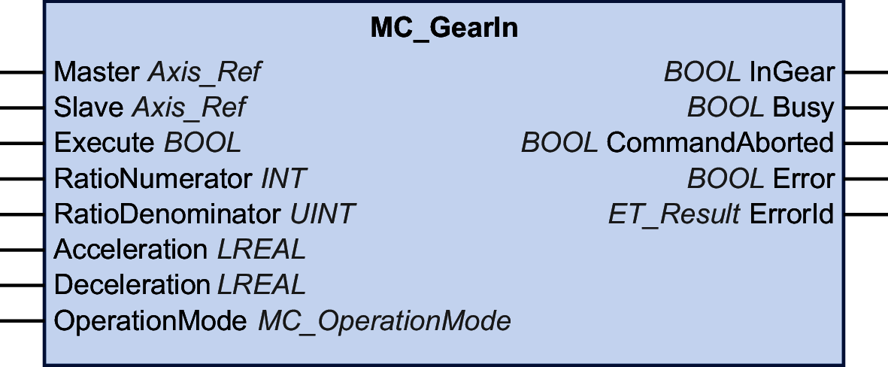

# MC\_GearIn

## Functional Description

This function block activates coupling of a master axis and a subordinate axis with a given gear factor between the position or velocity of the master axis and the subordinate axis, depending on the operating mode.

The subordinate axis synchronously follows the movement of the master axis (position or velocity synchronicity).

The inputs RatioNumerator and RatioDenominator let you set a user-specific gear ratio for the movement of the subordinate axis.

When the output InGear is set to TRUE, the operating mode set via the input OperationMode determines the type of coupling:

* In the operating mode Cyclic Synchronous Position, the coupling is performed based on position values. For example, with a gear ratio of 1:2, the subordinate axis moves half of the distance of the master.
* In the operating mode Cyclic Synchronous Velocity, the coupling is performed based on velocity values. For example, with a gear ratio of 1:2, the subordinate axis moves at half of the velocity of the master.

## Graphical Representation

## Inputs

| Input | Data type | Description |
| --- | --- | --- |
| Master | Axis\_Ref | Reference to the axis for which the function block is to be executed. |
| Slave | Axis\_Ref | Reference to the axis for which the function block is to be executed. |
| Execute | BOOL | Value range: FALSE, TRUE.  Default value: FALSE.  A rising edge of the input Execute starts the function block. The function block continues execution and the output Busy is set to TRUE.  This function block can be restarted while it is executed. The target values are overwritten by the new values at the point in time the rising edge occurs. |
| RatioNumerator | INT | Value range: -32.768 ... 32.767  Default value: 1  Numerator of gear ratio.  NOTE: The value 0 is invalid. |
| RatioDenominator | UINT | Value range: 1 ... 65.535  Default value: 1  Denominator of gear ratio. |
| Acceleration | LREAL | Value range: A positive LREAL value  Default value: 0  Acceleration in user-defined units.  The value at this input is used to reach the specified target velocity (acceleration). |
| Deceleration | LREAL | Value range: A positive LREAL value  Deceleration in user-defined units.  Default value: -1  NOTE: If the default value of -1 presented at the input Deceleration is used as a signal that the parameter has not been modified and therefore, the value at the input Acceleration is also used for the deceleration.  This is the threshold value of the acceleration during the ramp-in phase of MC\_GearIn in case that the absolute value of the velocity of the subordinate axis decreases. |
| OperationMode | [MC\_OperationMode](D-SE-0094936.html#D-SE-0094936__D-SE-0094936.13) | Operating mode for function block  Default value: Position  Possible values:   * Value Position * Value Velocity   See [MC\_OperationMode](D-SE-0094936.html#D-SE-0094936__D-SE-0094936.13) for a description of the values. |

## Outputs

| Output | Data type | Description |
| --- | --- | --- |
| InGear | BOOL | Value range: FALSE, TRUE.  Default value: FALSE.   * FALSE: The adjusted gear ratio is not reached. * TRUE: When the adjusted gear ratio is reached. |
| Busy | BOOL | Value range: FALSE, TRUE.  Default value: FALSE.   * FALSE: Function block is not being executed. * TRUE: Function block is being executed. |
| CommandAborted | BOOL | Value range: FALSE, TRUE.  Default value: FALSE.   * FALSE: Execution has not been aborted. * TRUE: Execution has been aborted by another function block. |
| Error | BOOL | Value range: FALSE, TRUE.  Default value: FALSE.   * FALSE: Function block is being executed, no error has been detected during execution. * TRUE: An error has been detected in the execution of the function block. |
| ErrorID | [ET\_Result](ET_Result-GeneralInformation-13E75E6E.html#ET_Result-GeneralInformation-13E75E6E) | This enumeration provides diagnostics information. |

## Notes

The input Acceleration needs to be set to a value greater than 0 before the function block is executed.

The gear ratio can be modified during a movement. However, the new values are taken into account only with the next rising edge of the input Execute.

The subordinate axis uses the values for Acceleration and Jerk only during the first acceleration phase. The subordinate axis then follows the master axis.

If the operating mode is set to Velocity via the input OperationMode and if the drive is not able to operate in the operating mode Cyclic Synchronous Velocity, the function block MC\_CamIn detects an error. The axis is not affected.

The library does not provide a separate function block MC\_GearOut. A running function block can be replaced by any other function block.

EIO0000003871.08