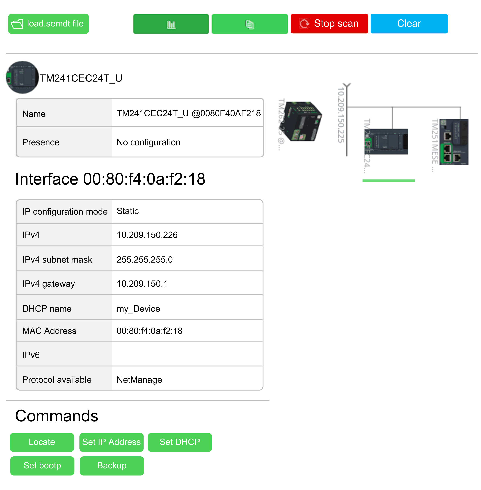

# General Information

## Library Overview

The library allows you to

* scan controller networks for connected devices via Ethernet.
* retrieve information related to a detected device like IP configuration, MAC address, model name, and so on.
* send commands to detected devices.
* clear the internal database (list of the detected devices).

The graphic provides an overview of the web browser interface of a Modicon M262 Logic/Motion Controller depicting a device on its network. The web browser interface allows you to execute similar functionality as that of the library.

## Characteristics of the Library

The following table indicates the characteristics of the library:

| Characteristic | Value |
| --- | --- |
| Library title | MachineAssistantServices |
| Company | Schneider Electric |
| Category | Devices |
| Component | Core Libraries |
| Default namespace | MAS |
| Language model attribute | [Qualified-access-only](../../../../../api/crossBook?lang=en-US&virtualBookName=SoLibref&topicID=D_SE_0081219) |
| Forward compatible library | Yes (FCL) |

NOTE: For this library, qualified-access-only is set. Therefore, the POUs, data structures, enumerations, and constants have to be accessed using the namespace of the library. The default namespace of the library is MAS.

## General Considerations

The MachineAssistantServices library is supported by the Modicon M262 Logic/Motion Controller.

## Protocols Used

The following protocols are used by the library:

* DPWS (Devices Profile for Web Services)
* NetManage
* EtherNet/IP
* Sercos/IP
* FTP (File Transfer Protocol)
* Modbus TCP

EIO0000003808.01

© 2022

Schneider Electric.

All rights reserved.