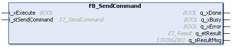

# FB\_SendCommand - Functional Description

## Overview

|  |  |
| --- | --- |
| Type: | Function block |
| Available as of: | V1.0.0.0 |

## Functional Description

The function block FB\_SendCommand is used to send a command to a detected device.

NOTE: Only one instance of FB\_SendCommand or FB\_ExtendedSendCommand can be executed simultaneously. If you call another instance while the function block is executed (`q_xBusy = TRUE`), a diagnostic message is generated.

NOTE: If the internal database is cleared (for example, after executing FC\_ClearScanList), you must execute FC\_Scan. Once the execution of FC\_Scan has completed, some waiting cycles are required for the controller to complete the scan. Typically this can take between 1 and 5 seconds, depending on the number of devices on the network. It is not possible to send a command to a device which is not available in the internal database.

| WARNING | |
| --- | --- |
|  | UNINTENDED EQUIPMENT OPERATION  * Verify that the machine operation state allows you to execute the command. * Start with the Locate command to identify the device.  Failure to follow these instructions can result in death, serious injury, or equipment damage. |

First using the Locate command helps you to ensure that you address the intended device.

## Interface

| Input | Data type | Description |
| --- | --- | --- |
| i\_xExecute | BOOL | The function block sends a command to a detected device upon a rising edge on this input. Refer to [*Common Inputs and Outputs*](i_xExecute-E1D1178E.html). |
| i\_stSendCommand | [ST\_SendCommand](D-SE-0093285.html#D-SE-0093285) | Structure that provides the single items, which are merged in the required command string. |

| Output | Data type | Description |
| --- | --- | --- |
| q\_xDone | BOOL | If this output is set to TRUE, the execution has been completed successfully.  The output is set for at least one cycle; however, it remains TRUE as long the input i\_xExecute is TRUE. |
| q\_xBusy | BOOL | If this output is set to TRUE, the function block execution is in progress.  Once an execution is stopped due to a successful completion or a detected error, this output is set to FALSE by the function block. |
| q\_xError | BOOL | If this output is set to TRUE, an error has been detected. For details, refer to q\_etResult and q\_etResultMsg. |
| q\_etResult | ET\_Result | Provides diagnostic and status information as a numeric value.  The output q\_etResult indicates the operating state and the execution result of the function block as a numeric value. |
| q\_sResultMsg | STRING[80] | Provides additional diagnostic and status information as a text message.  The output q\_sResultMsg indicates the operating state and the execution result of the function block as a text message. |

EIO0000003808.01

© 2022

Schneider Electric.

All rights reserved.