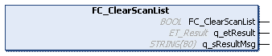

# FC\_ClearScanList - Functional Description

## Overview

|  |  |
| --- | --- |
| Type: | Function |
| Available as of: | V1.0.0.0 |
| Inherits from: | – |
| Implements: | – |

## Functional Description

The FC\_ClearScanList function is used to clear the internal database containing the devices detected during the last scan.

NOTE: If the function was executed successfully, it is not possible to send commands via FB\_SendCommand / FB\_ExtendedSendCommand.

## Interface

| Output | Data type | Description |
| --- | --- | --- |
| q\_etResult | ET\_Result | Provides diagnostic and status information as a numeric value. |
| q\_sResultMsg | STRING[80] | Provides additional diagnostic and status information as a text message. |

## Return Value

| Data type | Description |
| --- | --- |
| BOOL | TRUE: The function was executed successfully.  FALSE: Refer to the diagnostic information (q\_etResult, q\_sResultMsg). |

EIO0000003808.01

© 2022

Schneider Electric.

All rights reserved.