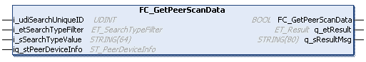

# FC\_GetPeerScanData - Functional Description

## Overview

|  |  |
| --- | --- |
| Type: | Function |
| Available as of: | V1.0.0.0 |
| Inherits from: | – |
| Implements: | – |

## Functional Description

The FC\_GetPeerScanData function is used to retrieve information of the specified device from the internal database containing the devices detected during the last scan.

NOTE:

* Even if FC\_ClearScanList was executed before, the internal database of connected devices can contain data, as the controller adds any device which is sending an identification message (could be caused by activity of other devices on the network).
* Wait 1...5 s (depending on the number of connected devices) after a new network scan (FC\_Scan) before you read the internal database with the different filter settings.
* The internal database of detected devices is stored on the controller memory and is not visible (accessible). Therefore, you cannot export internal data or access it with other file mechanisms.

## Interface

| Input | Data type | Description |
| --- | --- | --- |
| i\_udiSearchUniqueID | UDINT | Unique ID the search starts from. Use 0 for the first call of this function after executing FC\_ClearScanList.  If you received feedback information of the specified device, you can use ST\_PeerDeviceInfo.i\_udiPeerUniqueID as input for the next execution of this function to verify if another device is connected with same filter settings. |
| i\_etSearchTypeFilter | ET\_SearchTypeFilter | Enumeration describing which field is focused for the search. Also refer to ET\_SearchTypeFilter. |
| i\_sSearchTypeValue | STRING[64] | String on which the comparison is done with the data of the peer.  For example:   * `i_udiSearchUID = 0` * `i_etSearchTypeFilter = ModelName` * `i_sSearchTypeValue = TM2`   Returns the first peer which contains TM2 in its ModelName (could be a TM241, TM251, and so on). |

| Input/Output | Data type | Description |
| --- | --- | --- |
| iq\_stPeerDeviceInfo | ST\_PeerDeviceInfo | If a peer is detected, the data are copied to the structure ST\_PeerDeviceInfo. |

| Output | Data type | Description |
| --- | --- | --- |
| q\_etResult | ET\_Result | Provides diagnostic and status information as a numeric value. |
| q\_sResultMsg | STRING[80] | Provides additional diagnostic and status information as a text message. |

## Return Value

| Data type | Description |
| --- | --- |
| BOOL | TRUE: The function was executed successfully.  FALSE: Refer to the diagnostic information. |

## Examples

For examples, refer to [Best Practices](D-SE-0094978.html#D-SE-0094978).

EIO0000003808.01

© 2022

Schneider Electric.

All rights reserved.