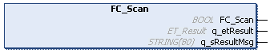

# FC\_Scan - Functional Description

## Overview

|  |  |
| --- | --- |
| Type: | Function |
| Available as of: | V1.0.0.0 |
| Inherits from: | – |
| Implements: | – |

## Functional Description

The FC\_Scan function is used to send a scan request (broadcast) to the device interfaces.

NOTE: Executing this function has an impact on your network load. Depending on the network load/device load, it takes some time until the connected devices send their feedback.

The scan request uses different [protocols](D-SE-0093002.html#D-SE-0093002__D-SE-0093002.11).

NOTE:

* The internal database is limited to 500 entries, meaning only 500 devices can be addressed with FC\_GetPeerScanData or FB\_SendCommand/FB\_ExtendedSendCommand.
* The internal database is filled in the order in which responses are received.
* It might be possible that a connected device is not part of the internal database (for example, if a device does not support the selected protocol).
* Wait 1...5 s (depending on the number of connected devices) after a new network scan before you use FC\_GetPeerScan data.
* Execute FC\_ClearScanList before you update the internal database with FC\_Scan, otherwise you can get outdated data, for example, a device is no longer connected but still listed in the internal database.
* Use the FC\_Scan function after you modify the configuration via FB\_SendCommand/FB\_ExtendedSendCommand to update the data of the connected devices in the internal database (for example, setting a new IP configuration).
* If third-party devices answer the broadcast message, they are added to the internal database.

## Interface

| Output | Data type | Description |
| --- | --- | --- |
| q\_etResult | ET\_Result | Provides diagnostic and status information as a numeric value. |
| q\_sResultMsg | STRING[80] | Provides additional diagnostic and status information as a text message. |

## Return Value

| Data type | Description |
| --- | --- |
| BOOL | TRUE: The function was executed successfully.  FALSE: Refer to the diagnostic information. |

EIO0000003808.01

© 2022

Schneider Electric.

All rights reserved.