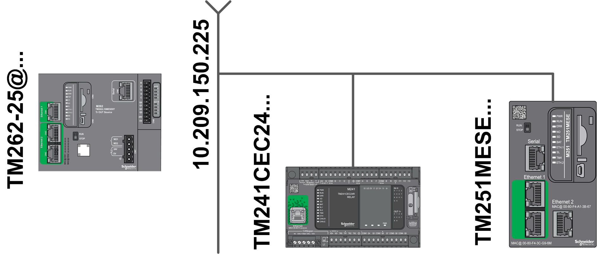
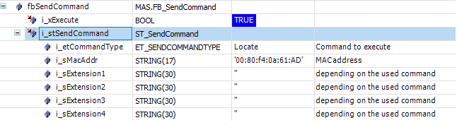
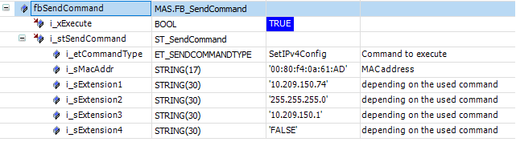
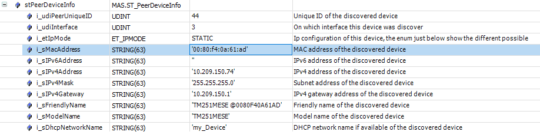
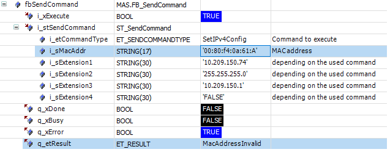
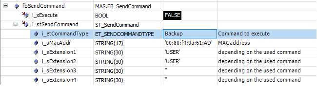
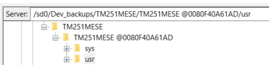
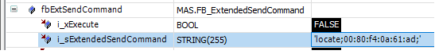

# Best Practices

## General

The following chapter may help you to avoid issues in your application.

## Preconditions

* Only devices which support one of the pre-defined [protocols](D-SE-0093002.html#D-SE-0093002__D-SE-0093002.11) are detected by the library.
* Verify that the FC\_Scan function was executed successfully before you use an instance of the function blocks FB\_SendCommand/FB\_ExtendedSendCommand or the function FC\_GetPeerScanData.
* Wait up to 5 seconds (depending on the number of connected network devices) after the execution of the FC\_Scan function has completed before you execute any other function or function block.
* The input i\_udiSearchUniqueID of the function FC\_GetPeerScanData must be 0 if you call this function after an execution of the function FC\_ClearScanList and FC\_Scan before executing the command.
* There is no syntax verification available for FB\_ExtendedSendCommand; therefore use FB\_SendCommand defined by the enumeration ET\_SendCommandType.
* Depending on the command, the structure ST\_SendCommand (input of FB\_SendCommand) contains different parts which are mandatory. The correct MAC address is required.

## Examples

The following examples are based on this network topology:



There are two detected devices stored in the internal database (M241 and M251 Logic Controllers).

## Examples for FC\_GetPeerScanData

Searching for a device by its model name:

| Step | Action |
| --- | --- |
| 1 | Set the inputs in the following way:   ``` i_uiSearchUniqueID := 0 i_etSearchTypeFilter := ModelName // use the enumeration ET_SearchTypeFilter to select a pre-defined filter i_sSearchTypeValue := 'TM241' ``` |
| 2 | Execute the function.  **Result**: The structure ST\_PeerDeviceInfo provides the M241 related information.    NOTE: If there are several M241 Logic Controllers connected to your network, use the unique Id (1 in this example) as input for i\_uiSearchUniqueID during the next execution. Repeat this procedure as long as FC\_GetPeerScanData is executed successfully to get the information for the M241 Logic Controllers. |

Searching for a device by its IPv4 address:

| Step | Action |
| --- | --- |
| 1 | Set the inputs in the following way:   ``` i_uiSearchUniqueID := 0 i_etSearchTypeFilter := IPv4 // use the enumeration ET_SearchTypeFilter to select a pre-defined filter i_sSearchTypeValue := '10.209.177.74' //IP address of the TM251 ``` |
| 2 | Execute the function.  **Result**: The structure ST\_PeerDeviceInfo provides the related information of the controller with this `IPv4` address. |

## Examples for FB\_SendCommand

* **Locate**

  Only the inputs i\_etCommandType and i\_sMacAddr must be set.

  

  The execution of this function block makes LEDs on the connected M251 Logic Controller flash for about 10 seconds.
* **IPv4 address**

  For changing the IPv4 address of an M251 Logic Controller temporarily (`Save = FALSE`), all elements of the input structure i\_stSendCommand must be set.

  

  NOTE: Verify if the new configuration is set correctly by executing:
  1. FC\_ClearScanList
  2. FC\_Scan
  3. FC\_GetPeerScanData

  In this example, you get:

  
* **MAC address**

  This example displays an incorrect command syntax (invalid MAC address)

  

  .

  There is a syntax verification implemented for any structure element, depending on the command.
* **Backup**

  To create a backup image of an M251 Logic Controller, the inputs i\_etCommandType, i\_sMacAddr, i\_sExtension1 (FTP user name), and i\_sExtension2 (FTP password) must be set.

  

  NOTE: The execution of this command may take several minutes.

  To verify if (and where) the backup is stored on the SD card (inserted into the M262 Logic Controller), you can open an FTP connection to the M262 Logic Controller.

  

## Example FB\_ExtendedSendCommand

There is only one input string defined where to enter the complete command, for example, for locate.



NOTE: There are no syntax or other completeness verifications implemented for the input i\_sExtendedSendCommand. You must be aware of the input content and ensure that it is correct. Only lower case characters are taken into account.

EIO0000003808.01

© 2022

Schneider Electric.

All rights reserved.