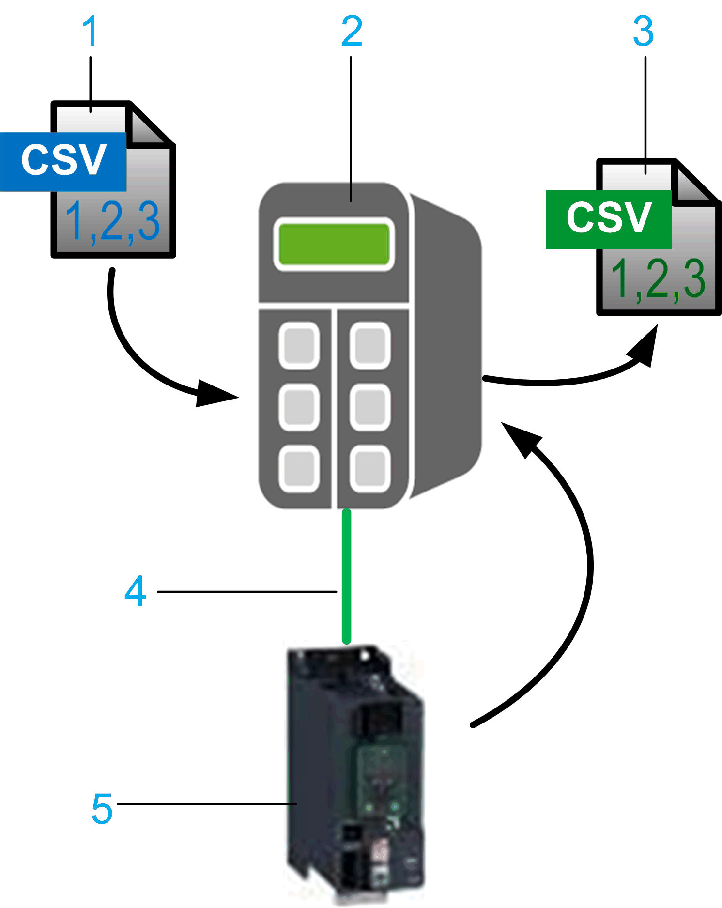

# FB_ParameterUpload

FB\_ParameterUpload

You can upload the values of parameters of a Sercos drive and store them in a Parameter File in the controller.

As a prerequisite for data uploading between the controller and the drive, a specific Character Separated Values (CSV) file must be available on the PacDrive LMC controller. This Index File must contain a list of all parameters of a Sercos drive you want to upload and save in a specified syntax. For further information, refer to the chapter [Index File](../Specifications/Specifications-2.htm#XREF_D_SE_0081722_1) and the manual of the supporting drive.

Reading and storing parameters in the controller using the FB\_ParameterUpload:

1   Index File saved in the PacDrive LMC controller

2   PacDrive LMC controller

3   Parameter File saved in the PacDrive LMC controller

4   Sercos bus

5   Supported Drive, for example ATV340S