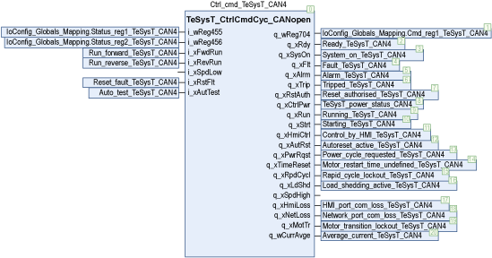
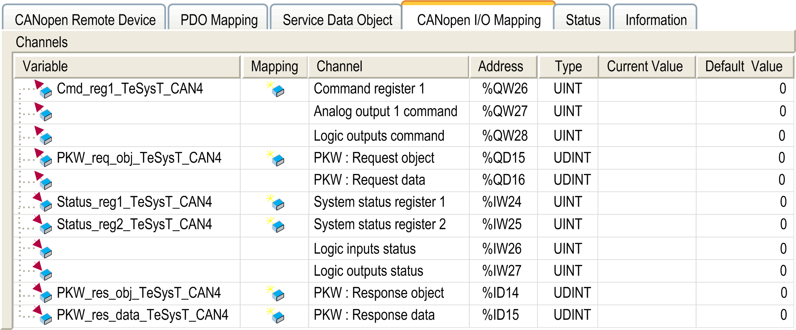

# Instantiation and Usage Example

Instantiation and Usage Example

This figure shows an instantiation example of the TeSysT\_CtrlCmdCyc\_CANopen function block:

This figure shows a visualization for the associated CANopen I/O Mapping dialog of TeSysT:

