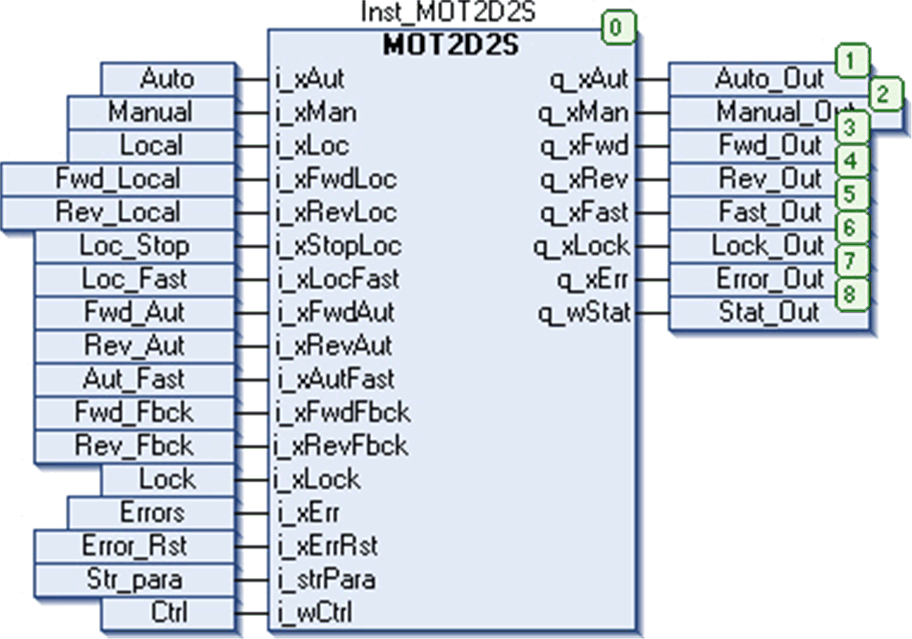

# Instantiation and Usage Example

Instantiation and Usage Example

This figure shows an instance of the MOT2D2S function block:

As shown by output pin q\_xAut, the block is operating in Auto mode. A reverse fast run command is issued at the input pins i\_xRevAut and i\_xAutFast which is shown at the output side on pins q\_xRev and q\_xFast