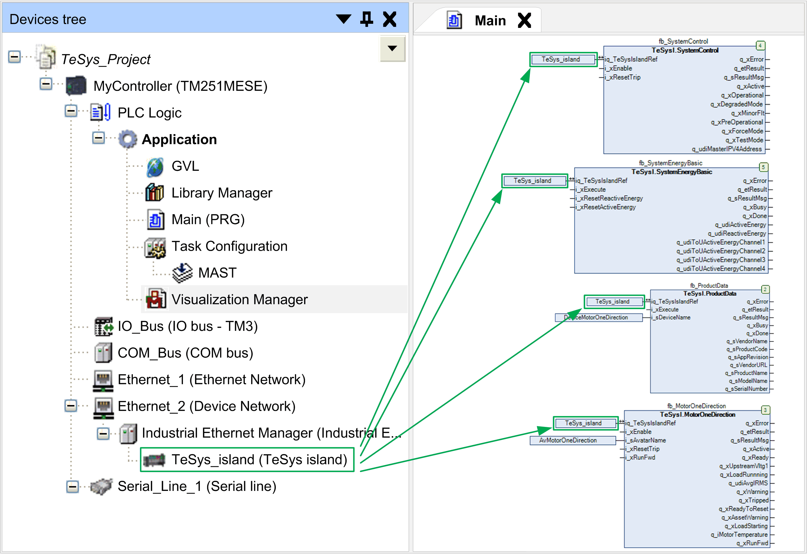
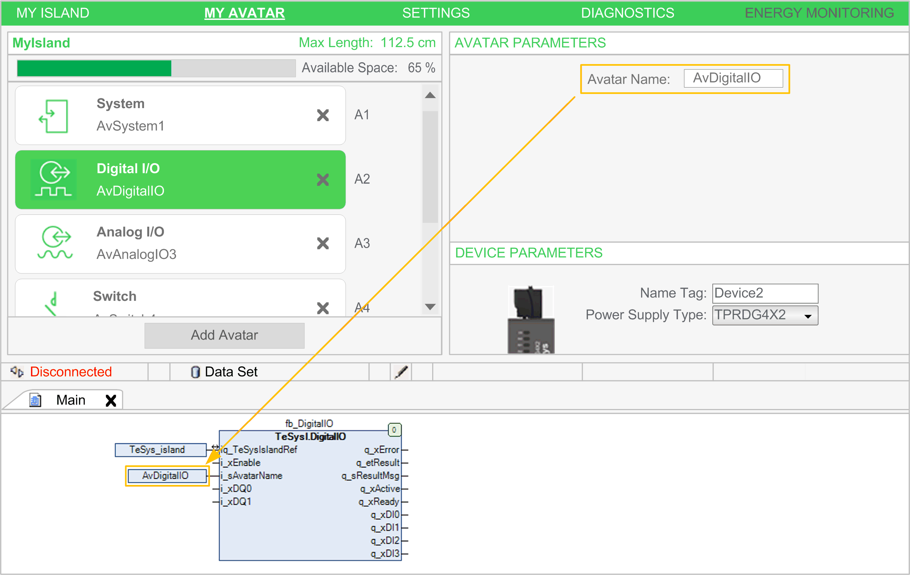
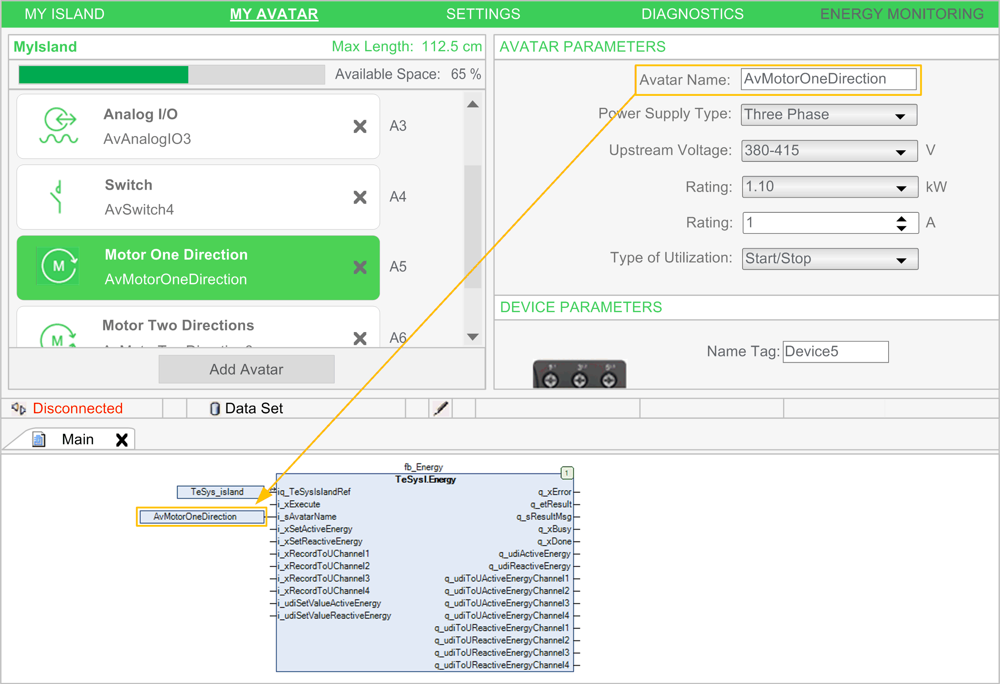
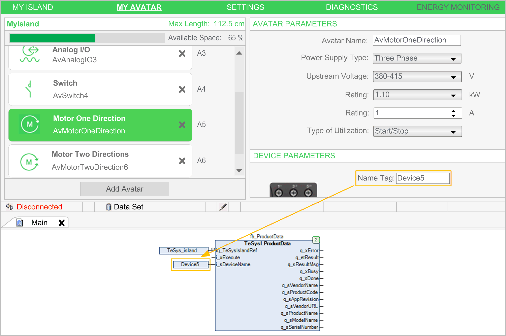
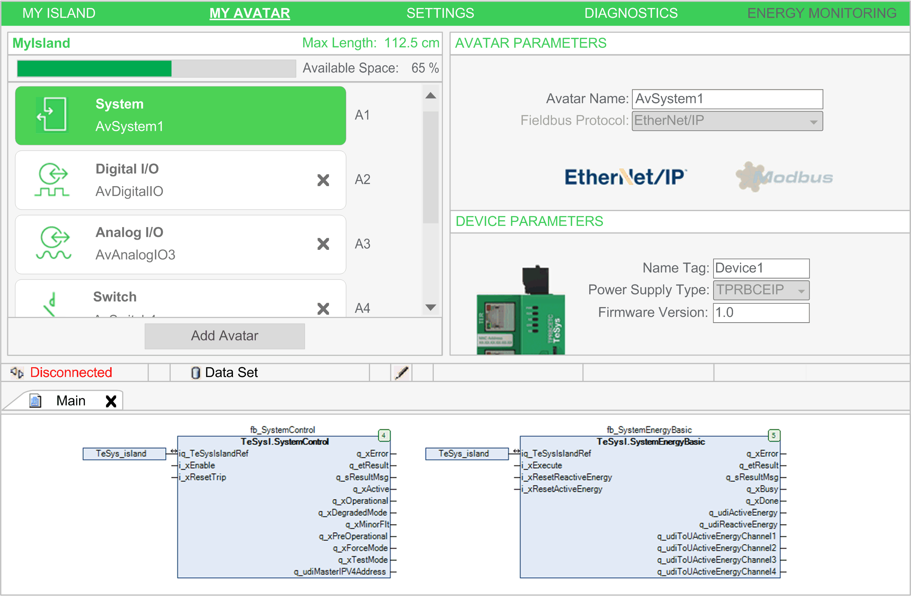

# Referencing Inputs to the TeSys island Library

## Referencing the TeSys island Bus Coupler from the Function Blocks

A reference to the TeSys island bus coupler is required by each function block of the TeSys island library. To achieve this, configure the name you assigned to the TeSys\_island node in the Devices tree as input iq\_TeSysIslandRef of the function blocks as indicated in the following example.

## Referencing Avatars

The avatar name is used to select the avatar to be controlled by the function block. It is available at the [avatar function blocks](D-SE-0095072.html#D-SE-0095072), except the asset management function blocks. If the avatar name parameter that is assigned is not correctly passed as an input to the function block in the TeSys island, the error message ET\_Result.AvatarNotAvailable is returned. Modifying this name during the execution of the function block is ignored.

How to assign the avatar name to the function block input i\_sAvatarName:

| Step | Action |
| --- | --- |
| 1 | Open the TeSys island configuration. |
| 2 | Select MY AVATAR. |
| 3 | Reference the avatar name (for example, AvDigitalIO or AvMotorOneDirection) to the function block input i\_sAvatarName.  NOTE: The avatar name can be found in the section AVATAR PARAMETERS. |

The following figure provides an example of the DigitalIO function block that is only available for Digital I/O avatars:

The following figure provides an example of the Energy function block that is available for all avatars, except for the System avatar:

## Referencing Devices

The name is used to select the device at the function blocks for asset management. If the parameter Name Tag is not configured or not correctly configured, the error message ET\_Result.DeviceNotAvailable is returned. Modifying this name during the execution of the function block is ignored.

How to assign the name tag to the function block input i\_sAvatarName

| Step | Action |
| --- | --- |
| 1 | Open the TeSys island configuration. |
| 2 | Select MY AVATAR. |
| 3 | Reference the name tag (for example, Device1, Device2 , Device3, and so on) to the function block input i\_sDeviceName.  NOTE: The device name can be found in the section DEVICE PARAMETERS. |

The following figure provides an example of the asset management ProductData function block that is available for all devices, except for the bus coupler (system device):

## System Function Blocks Automatically Referencing the Bus Coupler

In contrast to the above described function blocks, the system functions blocks do not require references to avatars or devices.

The SystemControl and SystemEnergyBasic function blocks, for example, do not have inputs referencing avatars or devices because they are directly linked to the bus coupler (system device):

EIO0000003855.05