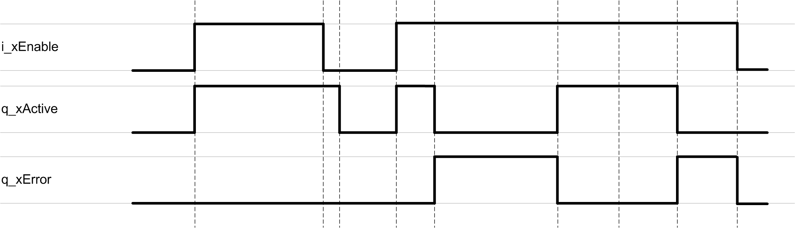

# Behavior of Function Blocks with the Input i\_xEnable

## General Information

A rising edge of the input i\_xEnable starts the cyclic data exchange between the function blocks and the selected avatar. As long as i\_xEnable is TRUE, the cyclic data is exchanged at every controller cycle. A falling edge of the input i\_xEnable stops the data exchange after the on-going communication has been terminated, and the values of the outputs are set to zero.

EIO0000003855.05