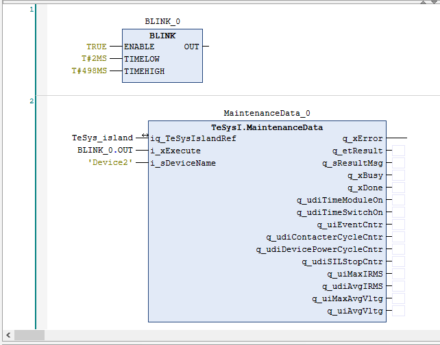

# Reading Acyclic Data Using the Input i\_xExecute

## General Information

To update the data that is retrieved from the function block, a periodically rising edge is required at the i\_xExecute input of the function block for acyclic data exchange. To achieve this, you can use the BLINK function block as indicated in the following application example.

## Application Example

| Step | Action |
| --- | --- |
| 1 | Open your project. |
| 2 | Add a BLINK function block to a POU that already contains a function block for acyclic data exchange. |
| 3 | Set the ENABLE input of the BLINK function block to TRUE. |
| 4 | Set the TIMELOW input to a value that suits your application, such as `2` ms. |
| 5 | Set the TIMEHIGH input to a value that suits your application, such as `495` ms. |
| 6 | Assign the output of the BLINK function block to the i\_xExecute input of the function block for acyclic data exchange, that is MaintenanceData in this example.  NOTE: Ensure that multiple instances of the function block are not running in parallel. |

EIO0000003855.05