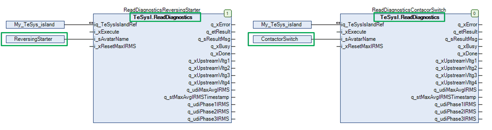

# Avatar Function Block Description

## Avatar Function Blocks - General Description

Avatars are a digital representation of the physical modules on the TeSys island.

The function blocks are fieldbus independent, only the TeSysIslandRef (TeSys island device in the Devices tree) is fieldbus-dependent. One specific TeSysIslandRef is available for every supported fieldbus. The type of this reference is FB\_TeSys\_island and an instance of this type is created automatically, when a TeSys island device is added to the Devices tree.

The avatar is referenced via the input i\_sAvatarName. The function block verifies if the referenced avatar input type is supported by the function block while executing. If not, the function block execution is canceled and the diagnostic message AvatarNotSupported is displayed.

The function blocks have no logic operations and are not modifying or interpreting the avatar data. They copy the values of their inputs into the cyclic output data frame and copy the data of the cyclic input frame to their outputs. If the function block requires acyclic data exchange, the read and write requests are managed by the function block.

The system provides one acyclic connection per TeSys island bus coupler so that the acyclic communication requests must be handled sequentially. A new request can only be sent if the response to the previous request was received. If an error is detected during the execution, the function block stops and provides the error information. You cannot stop the function block by the application (for example, cancel input).

Some function blocks are providing inputs to reset or preset parameters of the function block. When executing the function block and one of these inputs is TRUE, the update of the outputs is delayed until the reset or preset command is executed in the avatar.

There are two types of function blocks:

* System avatar function blocks
* Standard avatar function blocks

## System Avatar Function Blocks

The system avatar is unique in the TeSys island and supported by specific function block implementations, indicated by the string System in the function block name. These function blocks do not have the input i\_sAvatarName.

## Standard Avatar Function Blocks

The standard avatars are supported by two types of function blocks:

* Control function blocks
* Read/write function blocks

Each control avatar is supported by its own function block implementation, which can be instantiated for multiple usage of the same avatar type in one TeSys island. Create one function block instance for each avatar in your application and link the input i\_sAvatarName to the avatar.

There is only one implementation for the read/write function blocks Asset, Diagnostic, and Energy avatars available because most avatars are supporting the same asset, diagnostic, and energy data. Exceptions are described in the dedicated function block descriptions. Executing the function block for an unsupported avatar stops the function block with an error. For multiple usage of the same function block with different avatars, you have to create an instance of the function block for each avatar.

Example for two instances of the diagnostic function block used for two different avatars:

EIO0000003855.05