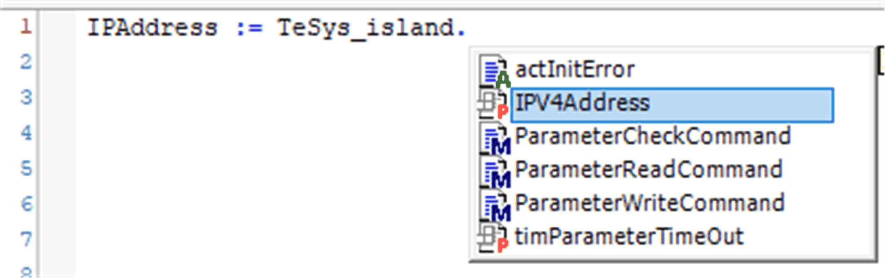

# ReadSystemDiagnostics - Functional Description

## Overview

|  |  |
| --- | --- |
| Type: | Function block |
| Available as of: | V2.0.3.0 |

## Functional Description

The function block ReadSystemDiagnostics returns and resets the diagnostic information of the system avatar.

## Interface

| Input | Data type | Description |
| --- | --- | --- |
| iq\_TeSysIslandRef | FB\_TeSys\_island | Reference to the TeSys island device. |
| i\_xExecute | BOOL | Upon a rising edge of this input, the function block starts the execution. The outputs q\_xDone, q\_xError, q\_etResult, and q\_etResultMsg are reset with the falling edge of i\_xExecute. Refer to [*Behavior of Function Blocks with the Input i\_xExecute*](D-SE-0069766.html#D-SE-0069766). |
| i\_xResetAlarmCntr | BOOL | If this input is set to TRUE, the counter of detected advisory alarms for the system is set to 0. |
| i\_xResetMinorEventCntr | BOOL | If this input is set to TRUE, the counter of detected minor errors for the system is set to 0. |
| i\_xResetComErrorCntr | BOOL | If this input is set to TRUE, the counter of detected errors for the fieldbus communication is set to 0. |

| Output | Data type | Description |
| --- | --- | --- |
| q\_xError | BOOL | If this output is set to TRUE, an error has been detected. For details, refer to q\_etResult and q\_etResultMsg. |
| q\_etResult | ET\_Result | Provides diagnostic and status information as a numeric value. |
| q\_sResultMsg | STRING[30] | Provides additional diagnostic and status information as a text message. |
| q\_xBusy | BOOL | If this output is set to TRUE, the function block execution is in progress. |
| q\_xDone | BOOL | If this output is set to TRUE, the execution has been completed successfully. |
| q\_xCtrlVltgFlctn | BOOL | If this output is set to TRUE, a control voltage fluctuation is detected. |
| q\_xSILStopStatus | BOOL | Status of SIL Stop 0 function. If this output is set to FALSE, no SIL group has received a SIL Stop command. |
| q\_uiComErrorCntr | UINT | Number of detected errors for the fieldbus communication. |
| q\_uiAlarmsCntr | UINT | Number of detected alarms for the system. |
| q\_uiMinorEventCntr | UINT | Number of detected minor events for the system. |
| q\_stMinorEventRegister1 | ST\_MinorEventRegister | Information on a detected minor event.  q\_stMinorEventRegister1 = most recent |
| q\_stMinorEventRegister2 | ST\_MinorEventRegister | Information on a detected minor event. |
| ... | ... | ... |
| q\_stMinorEventRegister5 | ST\_MinorEventRegister | Information on a detected minor event. |
| q\_etSILStopMsgGrp1 | ET\_SILStop | SIL group 1:  Information on the SIL Stop 0 function. |
| ... | ... | ... |
| q\_etSILStopMsgGrp10 | ET\_SILStop | SIL group 10:  Information on the SIL Stop 0 function. |
| q\_sIPV4Address | STRING[15] | IP address of the bus coupler (read from the TeSys island device in the programming software during initialization). |

NOTE: The IP address is also provided as a property of theTeSys island device. The IP address is updated during the initialization of the application.

Example:

EIO0000003855.05