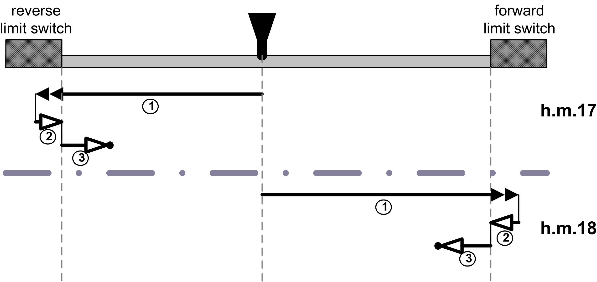
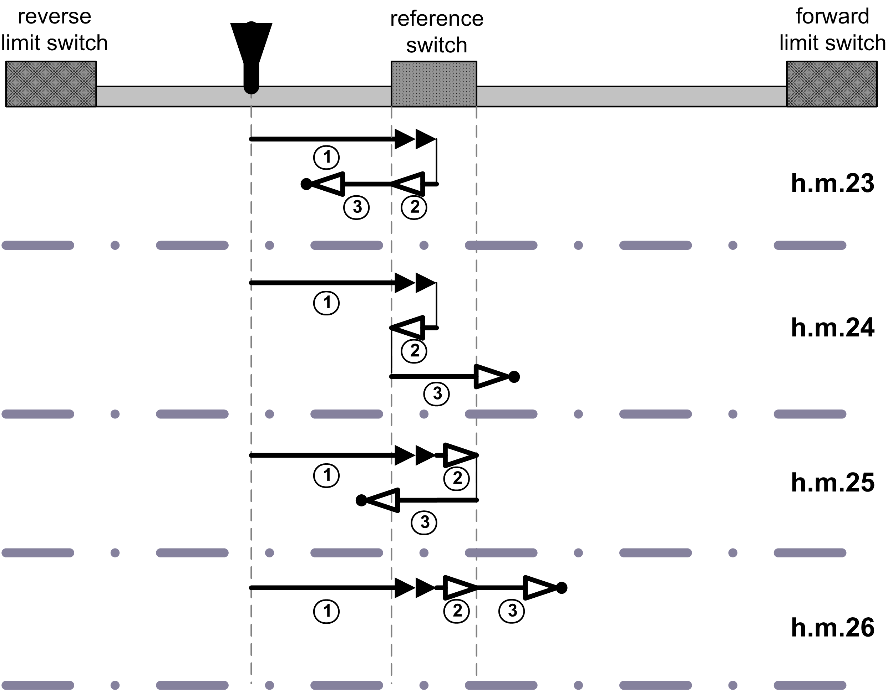
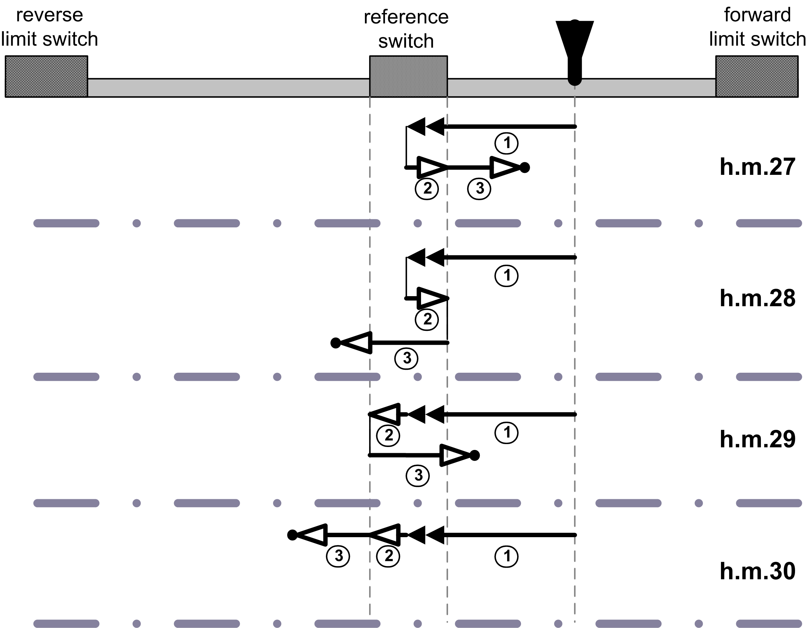
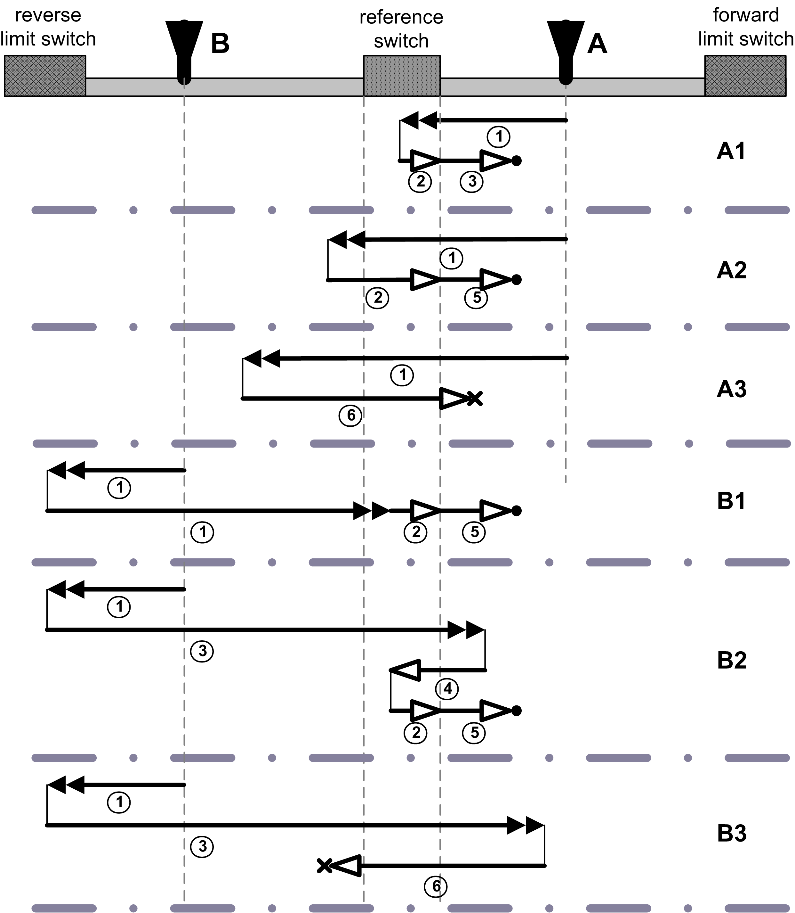

# wHmngMeth

wHmngMeth

The FB implements homing methods using forward and reverse limit switches (homing method 17,18), methods using reference position switch (homing method 23...30) and immediate homing at current position (homing method 35).

Homing method overview:

| Homing Method | Description |
| --- | --- |
| 17 | Homing on reverse limit switch. |
| 18 | Homing on forward limit switch. |
| 23 | Homing on reference position switch on falling edge of reference switch signal in reverse direction with clearance movement in reverse direction. |
| 24 | Homing on reference position switch on falling edge of reference switch signal in reverse direction with clearance movement in forward direction. |
| 25 | Homing on reference position switch on falling edge of reference switch signal in forward direction with clearance movement in reverse direction. |
| 26 | Homing on reference position switch on falling edge of reference switch signal in forward direction with clearance movement in forward direction. |
| 27 | Homing on reference position switch on falling edge of reference switch signal in forward direction with clearance movement in forward direction. |
| 28 | Homing on reference position switch on falling edge of reference switch signal in forward direction with clearance movement in reverse direction. |
| 29 | Homing on reference position switch on falling edge of reference switch signal in reverse direction with clearance movement in forward direction. |
| 30 | Homing on reference position switch on falling edge of reference switch signal in reverse direction with clearance movement in reverse direction. |
| 35 | Immediate homing. |

Homing methods (h.m.) 17 and 18

1   Movement towards limit switch at speed defined by i\_wHmngSpdRef.

2   Movement to homing edge at 1/4 of homing speed. The homing is performed at the rising edge of limit switch signal.

3   Clearance movement at 1/4 of homing speed reference. The clearance distance is defined in i\_stHmngPara.diHmngDistOut.

•   Position of the axis after successful homing.

NOTE: Homing methods 17 and 18 are using limit switches and therefore are applicable only on linear axis. They are not supported in Modulo mode.

Homing methods (h.m.) 23...26

1   Movement towards reference switch at speed defined by i\_wHmngSpdRef.

2   Movement to homing edge at 1/4 of homing speed. The homing is performed at the rising edge of reference switch signal.

3   Clearance movement at 1/4 of homing speed reference. The clearance distance is defined in i\_stHmngPara.diHmngDistOut.

•   Position of the axis after successful homing.

Homing methods (h.m.) 27...30

1   Movement towards reference switch at speed defined by i\_wHmngSpdRef.

2   Movement to homing edge at 1/4 of homing speed. The homing is performed at the rising edge of reference switch signal.

3   Clearance movement at 1/4 of homing speed reference. The clearance distance is defined in i\_stHmngPara.diHmngDistOut.

•   Position of the axis after successful homing.

The following figure shows various kinds of possible behavior of an axis during homing with homing method 27.

The examples under A) show possible behavior when homing starts between the reference switch and the forward limit switch. Examples under B) describe behavior for homing with axis starting between the reference switch and reverse limit switch.

Behavior of the axis may differ for various values of homing speed i\_wHmngSpdRef, various breadths of reference switch area and various execution times of the task calling AdvancedPo­sitioning FB.

Similar behavior can be expected from homing methods using a reference position switch (homing method 23...30).

Possible behavior during homing for methods 23...30:

1   Movement towards reference switch at speed defined by i\_wHmngSpdRef.

2   Movement to homing edge at 1/4 of homing speed. The homing is performed at the rising edge of reference switch signal.

3   Excessive speed (i\_wHmngSpdRef) causing overshoot of the reference switch.

4   Return movement after overshoot at 1/4 of homing speed reference.

5   Clearance movement at 1/4 of homing speed reference. The clearance distance is defined in i\_stHmngPara.diHmngDistOut.

6   The movement at reduced speed 1/4 of homing speed is still to fast and causes an overshoot of reference switch position.

•   Position of the axis after successful homing.

x   Position of the axis after Unsuccessful homing.