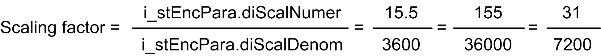

# diScalNumer / diScalDenom

diScalNumer / diScalDenom

These parameters are the numerator and denominator values used for position value scaling. These values are used to calculate the scaling factor. The scaling factor defines the relationship between the number of motor revolutions and the corresponding distance in user units.

For example, when the axis movement by 10 mm corresponds to seven motor revolutions, set

o i\_stEncPara.diScalNumer=7 and

o i\_stEncPara.diScalDenom=10.

This will configure the user unit to 1 mm.

If a higher resolution is needed, set the i\_stEncPara.diScalDenom=100. This will configure the user unit to 0.1 mm

Similarly, the FB may be configured for positioning in angular units.

When one revolution of the machine axis (gearbox output shaft) corresponds to 15.5 revolutions of the motor, and the required resolution is 0.1°, then set the

oi\_stEncPara.diScalNumer=155 and

o i\_stEncPara.diScalDenom=36000.

Numerator and denominator that are not relatively prime can be divided by their greatest common divisor.

In this case, it is 5. That results in:

You can change these parameters only when i\_xDrvRun = FALSE. When the axis is in Modulo mode, homing using homing method 35 is automatically performed on change of i\_stEncPara.diScalNumer or i\_stEncPara.diScalDenom.