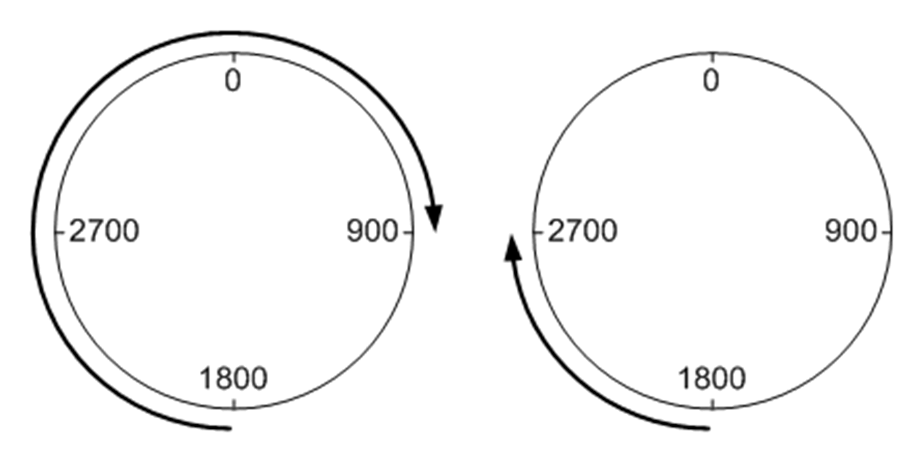

# xModulo

xModulo

With this parameter, you can select between positioning of linear (FALSE) and rotary (TRUE) axis. In Modulo mode is the position of the axis defined on a range between 0 and i\_stEncPara.diModRng.

Modulo mode is useful for positioning of axes turning in one direction because it helps prevent uncontrolled overflow of internal position.

Limit switch function (both, hardware and software) is disabled in Modulo mode.

Modulo movement is supported in both, absolute and relative modes, depending on setting of input i\_xPosMode.

Following images show movement with

oi\_diPosTarg = 900 and

owModDir = 1.

The left image shows positioning in absolute mode, the right image positioning in relative mode.You can change this parameter only when i\_xDrvRun = FALSE. When the axis is in Modulo mode, homing using homing method 35 is automatically performed on change of i\_stEncPara. xModulo.

Position in modulo movement

