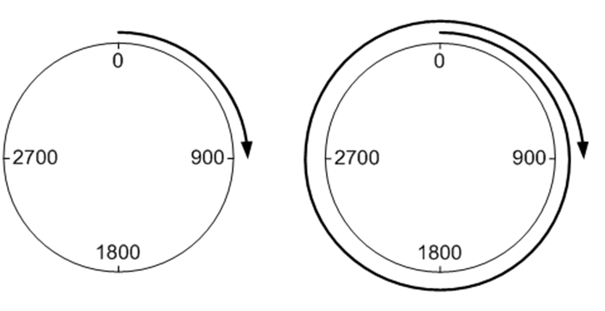

# xModMultiRng

xModMultiRng

With this parameter, you can select between positioning within one revolution of the modulo axis (i\_stEncPara.xModMultiRng = FALSE) and positioning over multiple modulo ranges (i\_stEncPara.xModMultiRng = TRUE).

It can be used to perform positioning tasks ending at the same position as the starting position (whole-number multiples of modulo range) or tasks exceeding modulo range.

The following example describes a positioning task with

otarget position i\_diPosTarg = 3600,

oon modulo range i\_stEncPara.diModRng = 3600,

owith wModDir = 1,

ostarting in position 0.

The diagram on the left side shows behavior in multiple-range mode and the one on the right behavior in the single range mode. In single range mode is the target position equal to the actual position and therefore the axis does not move.

Moving by whole-number multiples of modulo range

Following figures depict a positioning task

ostarting in position 0,

owith target position i\_diPosTarg = 4500,

oon modulo range i\_stEncPara.diModRng = 3600,

owith wModDir = 1.

The left figure shows positioning within one modulo range and the right one positioning over multiple modulo ranges.

Single and multi range mode

Multiple range mode is supported only in modulo directions 1 (positive) and 2 (negative). Mode 0 (shortest distance) is not supported.

Single and multiple-range mode positioning tasks are supported in both, absolute and relative positioning modes.