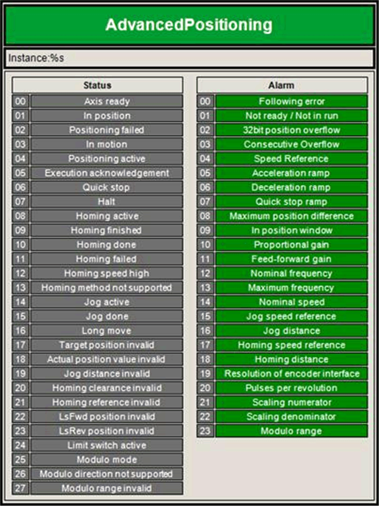

# Visualization

Visualization

This figure shows a visualization for the AdvancedPositioning function block:

The visualization of the AdvancedPositioning FB displays status and alarm words of the FB. Its purpose is to help with the commissioning of the FB.

It is available inside the library and can be selected in the configuration of frame visualization object under SE\_HOIST.Visu\_AdvancedPositioning.