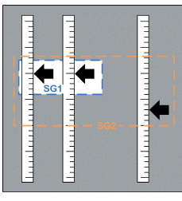
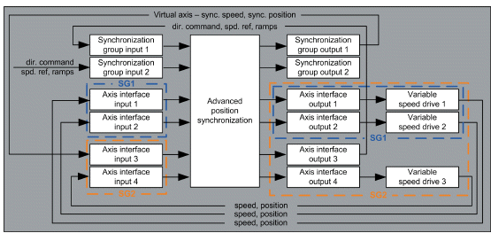

# Nested Synchronization of Three Axes

Nested Synchronization of Three Axes

There are three physical axes in this example. Two of them are synchronized together within the synchronization group 1. These two axes form a virtual axis which is further synchronized with the third physical axis within the synchronization group 2.

Nested synchronization

The function block uses the information from the output of the synchronization group 1 as a virtual axis. It then calculates a synchronous position and speed from the actual positions and speeds of the axes contained in the synchronization group 1.

This approach can be used for example if the axes within the synchronization group 1 are synchronized permanently and must be intermittently synchronized with another axis.

Following image describes the assignment of real and virtual axes to axis interfaces and the assignment of axis interfaces to axis groups.

Nested synchronization of three axes using one instance of the function block

Since the function block is executed once per cycle time, it takes effectively two execution cycles to synchronize both groups. This requires a short cycle time.

Alternatively, it is possible to use two instances of the function block for the nested synchronization.

Nested synchronization using two instances of the function block

This approach is equivalent to the previous one. It uses two instances of the function block to execute the nested synchronization within one period of the cyclic task.