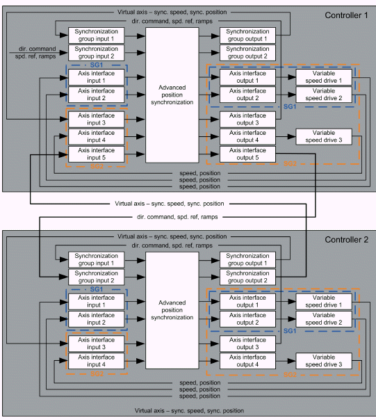

# Nested Synchronization of Six Axes Across Two Controllers

Nested Synchronization of Six Axes Across Two Controllers

The approach described in the previous section can be taken one step further. It is possible to synchronize multiple axes across two or more controllers.

There are six physical axes and two controllers in this example. Each controller controls movement of three physical axes directly. The controller 2 groups the synchronized axes to a virtual axis and provides information about actual position and actual speed of this virtual axis to controller 1. Controller 1 then handles this virtual axis as one of the axes connected to its axis interfaces within its synchronization group 2.

Nested synchronization with two controllers

The diagram illustrates that the synchronization group 2 of controller 1 contains both synchroni­zation groups of the controller 2. This multiple nesting is possible at a cost of certain transport delay in the controlled system. It is necessary to keep this delay as short as possible. The key is reduction of the execution periods of tasks executing instances of the AdvancedPositionSync function block, reduction of delays in communication between the two controllers and the delays in communication between the controllers and drives.

The advantage of this approach is that only information about a single virtual axis has to be transferred between the controllers. If the synchronization of multiple axes connected to two separate controllers is fully handled by one of these controllers, it is necessary to transfer information about all axes that are currently synchronized.

The choice of the fieldbus to deploy between the two controllers depends on the application. It must be able to transfer a sufficient amount of data in a sufficiently short time and must have a low jitter.

Nested synchronization with two controllers using one instance of the function block per controller

