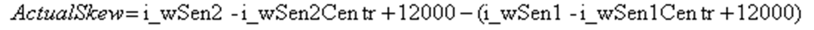

# Skew and Drift

Skew and Drift

Skew is a misalignment of the transversal axis of the crane bridge and the longitudinal axis of the crane runway. The crane has no skew when these axes are parallel.

Bridge in industrial cranes in a positive skew situation:

The actual skew is calculated from the reading of the 2 sensors and the center positions of the sensors. Center positions are input values that help to compensate for an imperfect mechanical alignment of the sensors. The values are configured during commissioning.

The formula for calculation of actual skew:

when i\_xSenPos = FALSE and when i\_xSenPos = TRUE

The actual value of skew is available at the q\_iSkewActl output of the FB.

Drift is a lateral misalignment of the transversal axis of the bridge in industrial cranes and the longitudinal axis of the crane runway. There is no drift if the 2 axes intersect in the middle of the bridge in industrial cranes.

Bridge in industrial cranes in a positive drift situation:

The actual drift is calculated from the reading of the 2 sensors and the center positions of the sensors. Center positions are input values that help to compensate for an imperfect mechanical alignment of the sensors. The values are configured during commissioning.

The formula for calculation of actual drift:

when i\_xSenPos = FALSE and when i\_xSenPos = TRUE

The actual value of drift is available at the q\_iDrftActl output of the FB.

Signs of the skew and drift do not depend on whether the sensors are mounted on the right or left side of the rail. The FB must get correct information about sensors placement via the i\_xSenPos input.

Skew and drift of the bridge in industrial cranes are present concurrently. When a bridge is skewed, it tends to drift in the direction of the skew while moving. This dependency is used by the correction algorithm.