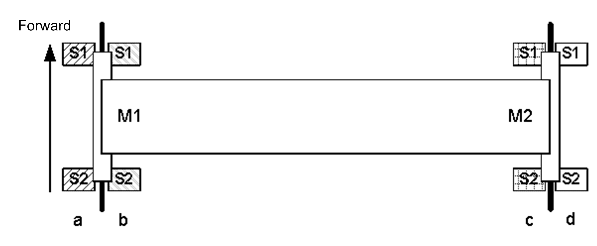

# i_xSenPos

i\_xSenPos

Selects between 2 possible positions of sensors. When FALSE, the FB is configured for sensors on the left side of the rail in direction of movement, positions a) and c) in the following figure. And when TRUE, the FB is configured for sensors on the right side of the rail, positions b) and d) in the following figure:

