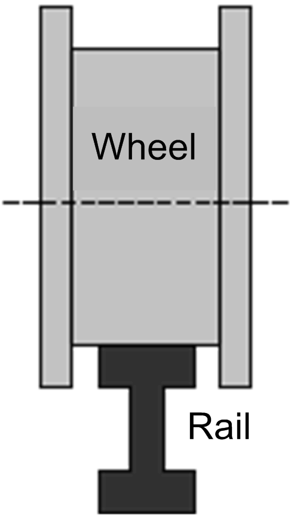

# Commissioning Procedure of the AntiCrab_2 Function Block

Commissioning Procedure of the AntiCrab\_2 Function Block

1.Even if the AntiCrab\_2 FB is going to be used together with AntiSwayOpenLoop\_2, first configured them independently. Steps 2 to 12 describe the standalone configuration of AntiCrab\_2 FB.

2.Set the drives to factory settings. In drive menu application functions disable, preset speeds. Set command and reference channel to the fieldbus communications.

3.Configure the Altivar variable speed drives (VSDs) with correct motor control parameters.

4.In the settings menu of Altivar drive enter the following:

oLow speed = 0 (or as close to 0 as possible)

oSlip compensation = 100 for more rigid control, lower value for softer control

oMotor control mode depending on machine configuration (SVC-V is preferred).

oIf a different drive is used, set the applicable parameters.

5.Verify that the fieldbus is functioning correctly between the controller and both drives.

6.Instantiate the FB and integrate it in your application.

7.Add scaling functions in order to scale the sensor output values.

8.Move the bridge in industrial cranes in manual mode in order to center the wheels of the bogie with attached sensors on the rail. The crane may be moved by controlling the drives independently, moving sides of the crane at slow speed.

The crane may be also centered on the rail by moving it against the buffer at the end of the runway.

When both wheels are centered on the rail, note down the scaled values of both sensors. Write these values as center positions on inputs i\_wSen1Centr and i\_wSen2Centr.

Once the wheels are centered, verify also the other side of the crane. The wheels on the other side of the bridge should be centered as well. If they are too far from the center, it could signal problems with the geometry of the crane or crane runway.

9.Set both drift and skew controllers gain to 0 and move the crane without Anti-crab to get familiar with its behavior.

10.Leave the drift control gain at 0. Increase the value of proportional gain of skew controller gradually while moving the crane and trace the value of actual skew and actual speeds. Find an optimum value of skew controller. The skew should be reduced to a low value without causing oscillations of the motor speeds on both sides of the bridge.

Watch the drift of the bridge in industrial cranes during the movement. If the bridge tends to drift to the left in one direction of movement and to the right in the other direction of movement, it is possible that the center positions are not set correctly and the skew controller does not keep the bridge in industrial cranes straight. In this case, modify the i\_wSen1Centr and i\_wSen2Centr values.

11.Keep the setting of the skew controller and start to increase the gain of the drift controller. Find an optimum value of the drift controller.

12.Watch the torque of both drives during the tuning. The purpose of Anti-crab is not keeping the crane dead centered at all cost. It should prevent the wheels from grinding the rails. It is necessary to find an optimal compromise between centering of the bridge and balance of the torques.

13.When the independent configuration has successfully been done, the outputs of the AntiSwayOpenLoop\_2 FB may be connected to inputs of the AntiCrab\_2 FB.