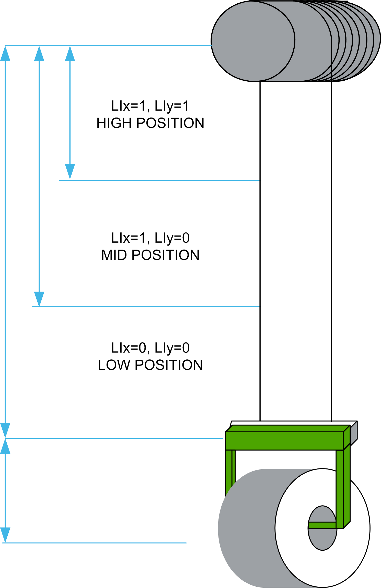

# Why Use the Cable Length Function?

Why Use the Cable Length Function?

The following figure represents the cable length overview of Anti-sway function.

The Cable length function is designed to provide:

othe actual cable length.

othe possibility to add the load length.

othe possibility to perform a calibration when the encoder method is used.

oa register to manage the status of any detected alarms.

othree solutions for managing the cable length.

oautomatic solution with screw selector

osemi-automatic solution with switch selector

oautomatic solution with encoder