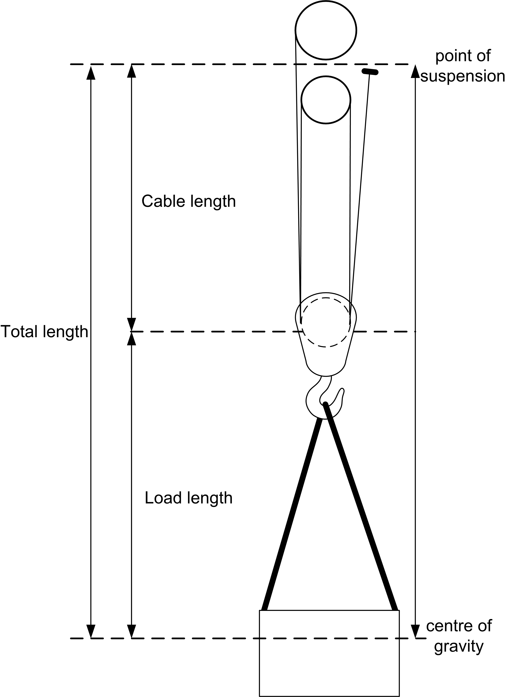

# Function Block Description

Function Block Description

This function block calculates the actual cable length using an encoder. It is possible to perform a calibration with any given encoder resolutions. The function block does not require any inputs from the operator after the calibration has taken place. Additionally it is possible to add the length of the carried load to the calculated length of the cable to achieve higher precision of the Anti-sway function block.

This function block is needed to provide the accurate length of the hoist cable to the Anti-sway function block. The performance of Anti-sway depends on the accuracy of that value.

Length diagram of CableLengthEnc\_2 function block:

