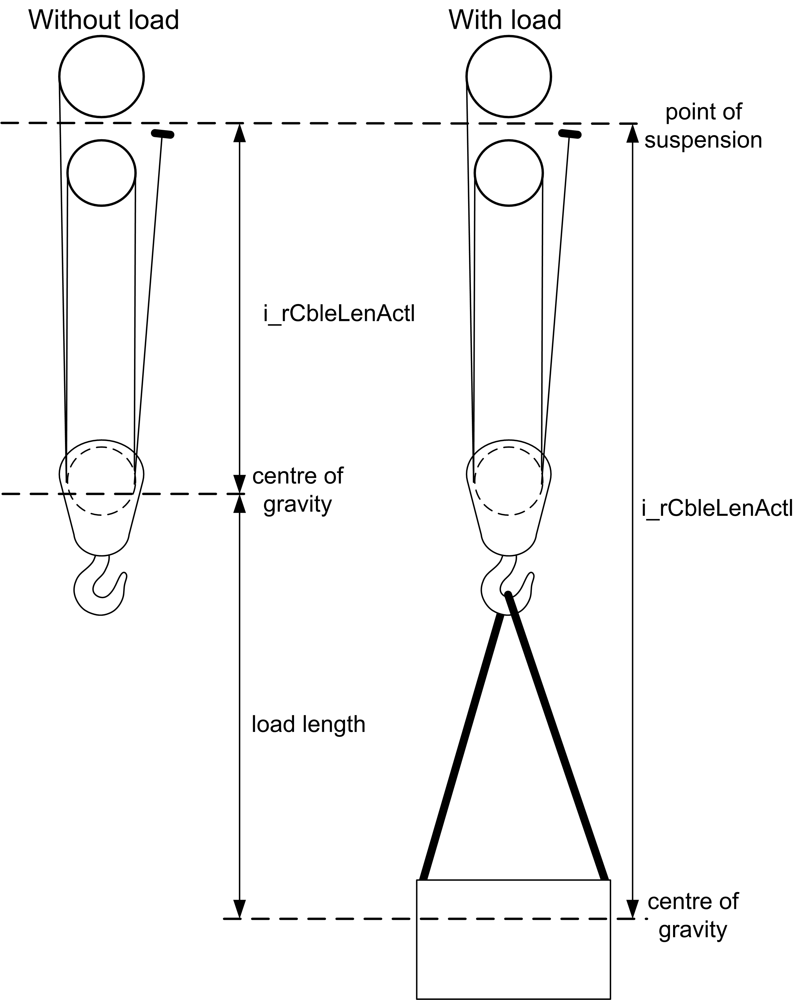

# i_rCbleLenActl

i\_rCbleLenActl

This is the actual cable length from the point where the rope is attached to the drum (or the average position for complex systems) to the approximate center of gravity of the system (the system consists of the hook, load and also rope, but the rope can usually be neglected) in meters (coming from the CableLength function block or similar). The load length must be added to the cable length beforehand.

Correct setting of i\_rCbleLenActl input:

