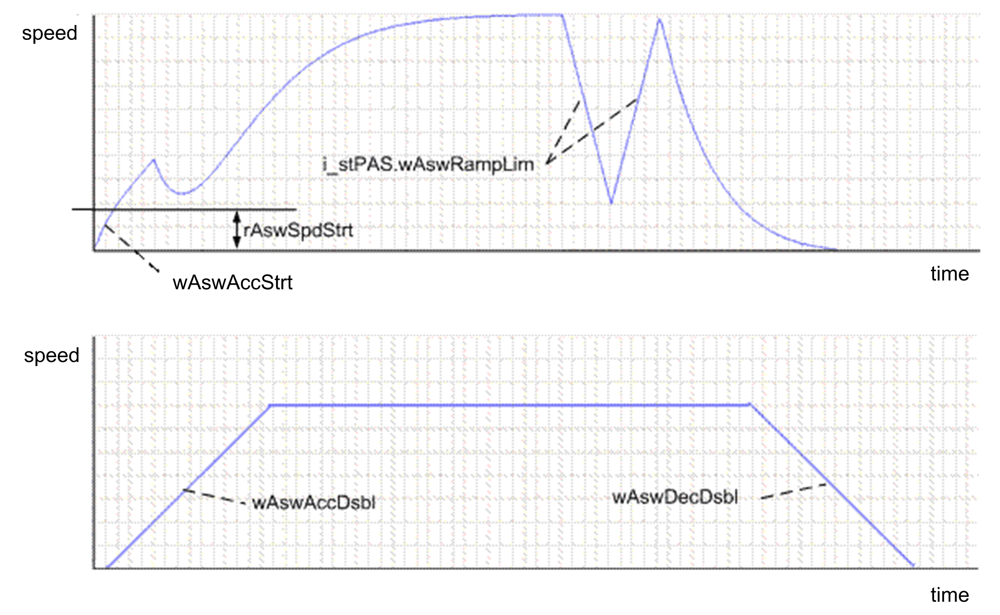
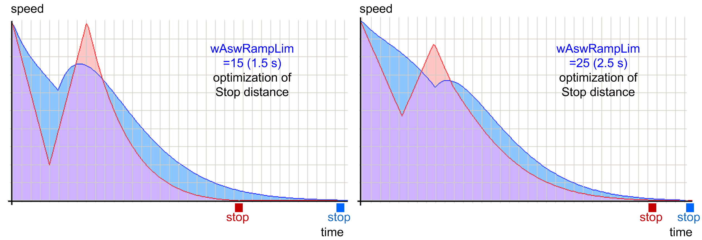
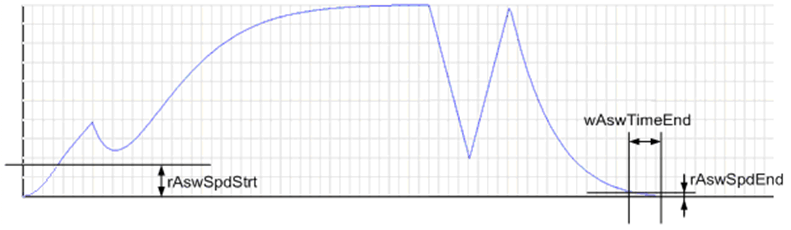

# Commissioning Procedure of the AntiSwayOpenLoop_2 Function Block

Commissioning Procedure of the AntiSwayOpenLoop\_2 Function Block

The AntiSwayOpenLoop\_2 FB contains an open loop control algorithm. Therefore it does not require feedback from the drive. However, when the drive enters an error state during a movement, the Anti-sway control must be stopped and the function block must be reinitialized.

This section describes the configuration of the FB using the i\_stPAS input structure and the influence of these parameters on the behavior of the crane. Only specific parameters which require extended explanation in addition to the basic description of i\_stPAS are mentioned here.

1.i\_stPAS.wAswAccDsbl, i\_stPAS.wAswDecDsbl. The FB uses these parameters as an acceleration and deceleration ramp when the Anti-sway function is disabled. Set them to values suitable for operation without Anti-sway.

2.i\_stPAS.wAswAccStrt, i\_stPAS.wAswDecStrt. The optimal setting is usually a long ramp. It helps to protect the load from sway during short movements below i\_stPAS.rAswSpdStrt when Anti-sway is enabled.

Start with a value of 10 s.

Default value:

i\_stPAS.wAswAccStrt:=100

i\_stPAS.wAswDecStrt:=100

3.i\_stPAS.wAswRampLim. Defines the steepest ramp the Anti-sway function is allowed to use in order to correct the sway. Low values for this parameter makes the correction more aggressive and allows shortening of the acceleration and deceleration phase, which improves the load handling for the operator (it is easier to estimate a 2 m stop distance than a 4 m and therefore it is possible to arrive at the target position more precisely). The disadvantage is that the stress on the crane structure increases. It is essential to find the right compromise during commissioning.

q\_wStat. Bit 6 gives information on whether an additional stop distance optimization is possible with the current combination of i\_stPAS.wAswRampLim and i\_rCbleLenActl. If it is not possible, the i\_stPAS.wAswRampLim value can be lowered in order to allow for the optimization.

The stop distance optimization is beneficial mainly with longer cable lengths close to or over 10 m. For shorter cable lengths the effect is not that significant and the stopping distances are acceptable without optimization.

4.i\_stPAS.wDrvDecEmgy. The value of this parameter must be small enough to stop the crane safely when a stop limit switch is reached or a contact signal from a brake is lost. (Default value: 5)

5.i\_stPAS.xOptimRampDecEn. Enables additional stopping distance optimization. It allows a considerable shortening of the stopping distance. The performance of this function depends on maximum allowed steepness of the acceleration and deceleration ramp (see description of i\_stPAS.wAswRampLim. A steeper acceleration and deceleration ramp results in shorter stop distance and time but at the cost of higher mechanical stress on the crane structure.

The following figures show an optimized (red) and non-optimized (blue, rounder form) Anti-sway speed profile for a crane with 8 m cable length moving at 1 m/s with various acceleration and deceleration ramps:

6.i\_stPAS.rAswSpdStrt. Defines the speed threshold at which Anti-sway starts to correct the sway (% of maximum speed). Micro movements are often a concern when commissioning an Anti-sway function. The majority of operators request Anti-sway to be disabled during short movements. If this is the case, set the i\_stPAS.rAswSpdStrt threshold above the micro/jog speed.

7.i\_stPAS.wAswAccStrt, i\_stPAS.wAswDecStrt. It is also better if the ramps at low speed are longer than usual to minimize the sway and increase the positioning precision. (see description of step 2 i\_stPAS.wAswAccStrt, i\_stPAS.wAswDecStrt).

8.i\_stPAS.rAswSpdEnd. Defines the speed threshold to stop the Anti-sway correction at the end of a movement (% of maximum speed). Setting this value too high stops the movement earlier but decreases the performance. Setting it too low increases the stopping time. (Default value: 1)

9.i\_stPAS.wAswTimeEnd. Defines how long must be the speed output reference below i\_stPAS.rAswSpdEnd to consider the movement finished.

Description of i\_stPAS.rAswSpdStrt, i\_stPAS.rAswSpdEnd and i\_stPAS.wAswTimeEnd parameters:

10.Be aware that an Anti-sway speed profile is generally longer (in both time and distance) than a linear acceleration speed profile. Therefore you must have in place limit switches on the crane adjusted to allow safe stopping/slowdown with all possible speeds and cable lengths.

11.As a safeguard, the application should check the difference between speed reference and actual speed and stop the movement if the difference is too great. This is not implemented in the FB since it is application dependent.