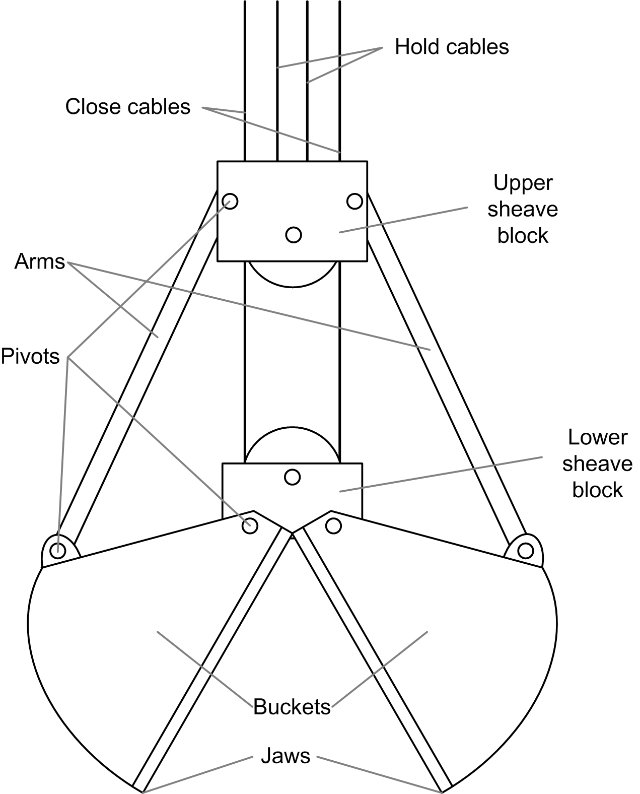

# Targeted Cranes

Targeted Cranes

The function block is suitable for control of four cable grabs. It supports both clamshell and spider grabs and can be used on bridge cranes, gantry cranes, luffing jib cranes and floating grab cranes.

The schematic diagram of clamshell grab is as follows:

