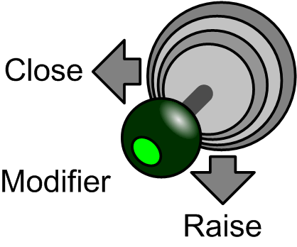

# Scraping

Scraping

Scraping is a special case of closing on stack usable with clamshell grabs. Its purpose is to gather remaining material from a flat surface. The grab closes while the jaws stay in contact with the surface.

When the grab is fully closed, the function starts upwards movement of the grab.

The command to activate scraping is as follows:

The function is optional and does not need to be configured and used if it is not needed.

An additional modifier button, preferably on the joystick, is needed. The same button may be also used for rapid opening function.