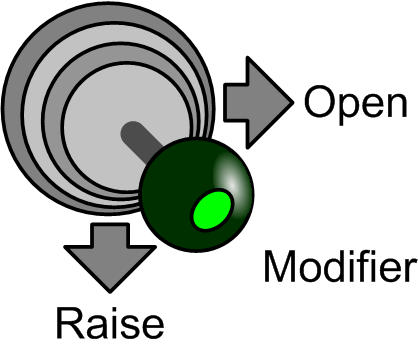

# Rapid Opening

Rapid Opening

This function allows fast opening of the grab in order to release the load as quickly as possible. It is typically used when the grab is emptied while it is in a swing. The feature is usually used on pontoon cranes with a luffing jib.

The following figure is the command to activate rapid opening:

The function is optional and does not need to be configured and used if it is not needed.

An additional modifier button, preferably on the joystick, is needed. The same button can also be used for scraping function.