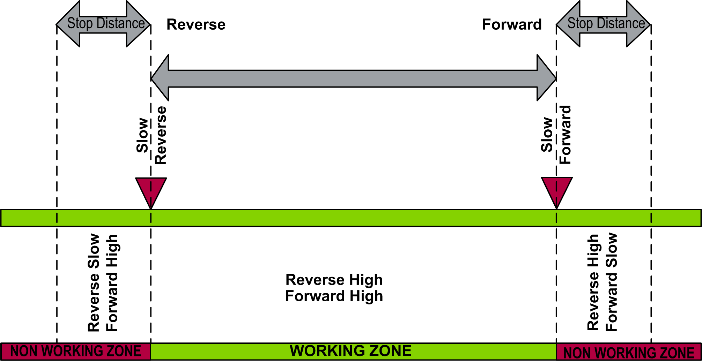

# Fwd/Rev Slow: Configuration with Stop on Distance

Fwd/Rev Slow: Configuration with Stop on Distance

NOTE: If a Stop on Distance is executed while in the non-working zone, movement towards the slow switch is possible, but movement in the opposite direction is blocked until the slow limit switch is passed.