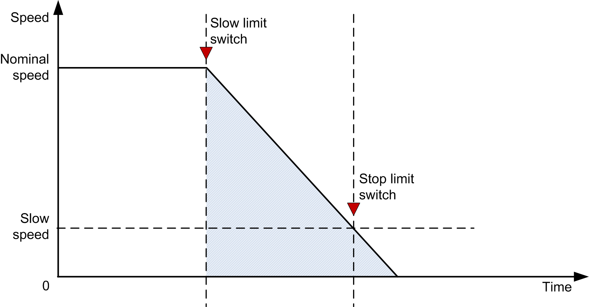

# Stop on Distance

Stop on Distance

The function block has the functionality to stop the trolley/bridge on distance after passing the Slow Forward or Slow Reverse position. To enable this functionality, enter any value greater than zero at i\_wDistStop. If the input is equal to zero, the Stop on Distance function is disabled.

The function block converts the actual RPM from the drive to the equivalent actual linear speed in m/s. From this conversion, the function block calculates the traveled distance. When the traveled distance is greater than the configured stop distance, the Forward Run signal(q\_xDrvFwd)or the Reverse Run signal(q\_xDrvRev)is turned off (depending on which way the crane is moving).

Example:

oStop distance: 3 m

oNominal speed of the drive: 1500 RPM

oNominal linear speed: 1 m/s

oIf the actual speed of the drive = 600 RPM, the actual linear speed (m/s) =

1 m/s \* 600 RPM /1500 RPM = 0.4 m/s

oDistance traveled in meters during one sample time = ((0.4 m/s \* Sample Rate in ms)/1000)

oWhen the distance traveled is greater than the stop distance, the drive stops and further movement in the same direction is not allowed.

The following figure represents the speed time curve of LimitSwitch function block.

