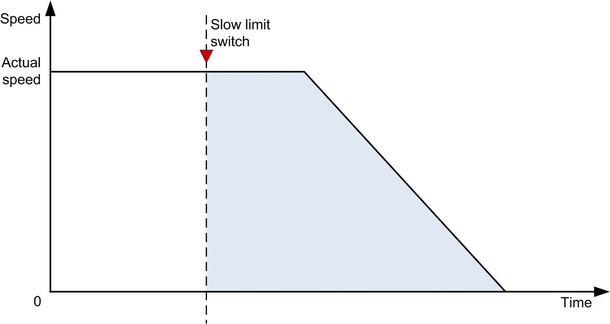

# Example

Example

oStop distance: 3 m

oNominal speed of the drive: 1500 RPM

oNominal linear speed: 1 m/s

oIf the actual speed of the drive = 600 RPM, the actual linear speed (m/s) = 1/ms \* 600 RPM / 1500 RPM = 0.4 m/s

oDistance traveled in meters = ((0.4 m/s \* internal calculated cycle time) / 1000)

oWhen the distance traveled is greater than the stop distance, the drive stops and further movement in the same direction is not allowed.

NOTE: The following chart shows the actual speed of the drive.

The following figure represents the speed time curve of DoubleLimitSwitch\_AR\_2 function block:

The following figures describe the benefit of using an adaptive ramp function.

The first chart shows the behavior when entering a property configured slow-down area at nominal speed:

The second chart describes entering a slow-down area at a speed that is approximately half of the nominal speed with an adaptive ramp function:

The third chart shows the behavior without the adaptive ramp function. The shaded area corresponds to the distance traveled in a slow-down area at a given speed.

By using the DoubleLimitSwitch\_AR\_2 for 2 cranes (bridges or trolleys) moving on the same rail, the input i\_xDisLsAlrm has to set to TRUE to disable alarms based on combination of limit switch states.

|  |
| --- |
| Warning_Color.gifWARNING |
| COLLISION OF TWO BRIDGES/TROLLEYS |
| Use proximity sensors to avoid collisions between bridges/trolleys. |
| Failure to follow these instructions can result in death, serious injury, or equipment damage. |

When 2 cranes approach each other, the sensor head receives signal a reflected from the reflector. With this, presence of another crane is sensed and movement of approaching crane is stopped in that particular direction. The crane can move in any other direction (away from another crane) any time. Likewise, another unit is fixed on another crane and its reflector is fixed on the first crane. Therefore, each time the cranes approach each other within a specified distance, movement is stopped and collision of the cranes is avoided.