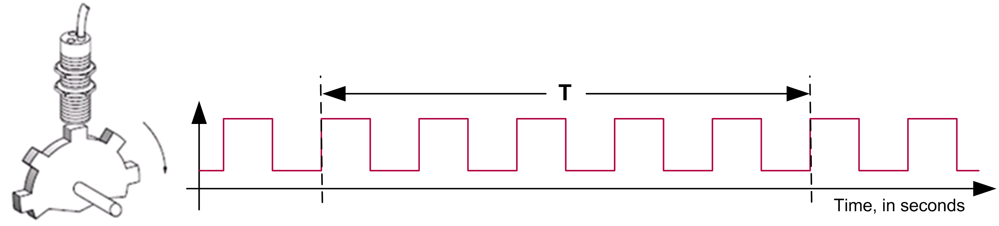
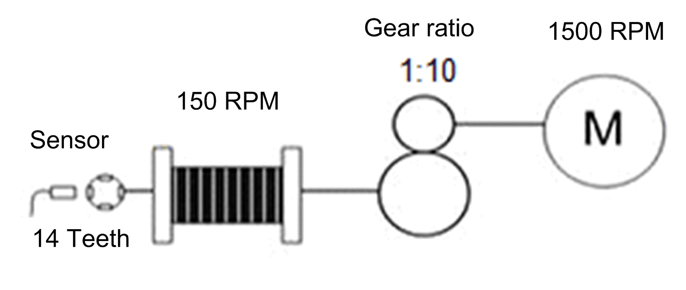

# Calculation of the Pulse Frequency

Calculation of the Pulse Frequency

T Represents the period for which the pulses are measured.

The most important feature of an overspeed detection function is a fast reaction in case of an overspeed. The function block adjusts the period of measurement according to requested accuracy of the measurement and number of detected pulses. Measurement period gets shorter as the frequency of pulses increases. This allows the FB to react quickly in case of an overspeed situation. The accuracy and reaction time at low speeds are secondary.

Example:

The following example illustrates the ratio between motor and cogwheel fixed on the drum.

o1 rotation of the drum causes 14 pulses on the sensor

o1 rotation of the drum causes 10 rotations of the motor shaft

onumber of teeth on the cogwheel is 14

onumerator factor is 10

odenominator factor is 1

The function block calculates the pulse frequency of incoming pulses from the cogwheel. These pulses and the motor gear box ratio (numerator factor / denominator factor) are used to calculate the speed of the motor.

In case that only the gear box ratio is given on the nameplate of the gear box, the numerator factor is set to the gear box ratio and the denominator to 1.

If the sensor is not attached directly on the drum behind the gear box but further on the cogwheel, the ratio between drum and the cogwheel must be taken into account.