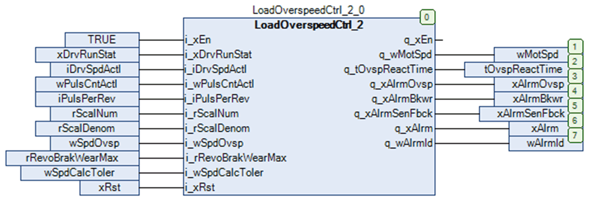

# Instantiation and Usage Example

Instantiation and Usage Example

This figure shows an instantiation example how to combine the LoadOverspeedCtrl\_2 function block with the high speed counter input of the controller.

