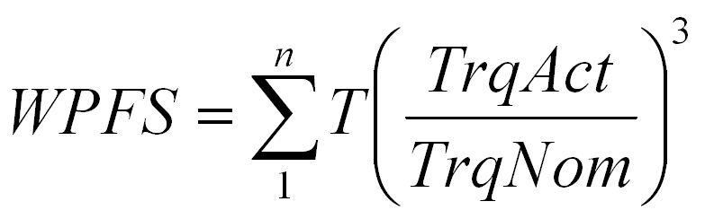

# Formula to Calculate WPFS without a Load Cell

Formula to Calculate WPFS without a Load Cell

In this case, the following relationship is used to calculate WPFS:

Where:

T= Actual cycle time. This time is calculated internally.

TrqAct = Actual motor torque.

TrqNom = Nominal motor torque.