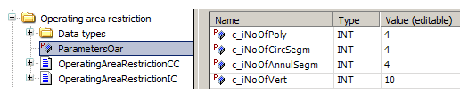

# Configuration of Parameter List

Configuration of Parameter List

Number of polygons and number of vertices reserved for one shape is defined by parameters within the Library Manager.

The parameter c\_iNoOfPoly defines the number of available polygonal restricted areas. The minimum allowed value is 1. When it is set to a value lower than 1, the number of polygons is forced to 1.

The parameter c\_iNoOfVert defines the number of vertices available for definition of one restricted area. The minimum allowed value is 3. When it is set to a value lower than 3, the number of vertices is forced to 3.

The setting influences all instances of the function block instantiated within one application. The default configuration defines four polygonal areas with ten vertices per polygon.

These parameters are common for operating area restriction function blocks for both industrial and construction cranes.

Parameters c\_iNoOfCircSegm and c\_iNoOfAnnulSegm are not used by OperatingAreaR­estrictionIC function block.

The system must be thoroughly tested with the maximum number of active restricted areas during commissioning to measure the influence of the number of active restricted areas on the overall performance of the controller. The watchdog of the cyclic task containing execution of this function block must be active.

Definition of number of polygons and vertices per polygon:

