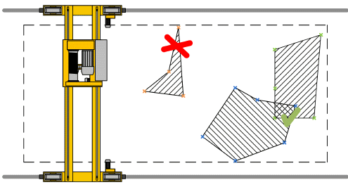

# Supported Shapes of Restricted Areas

Supported Shapes of Restricted Areas

The function block supports polygonal restricted areas. The restricted areas may overlap.

Polygonal restricted areas:

An polygonal restricted area is defined by 3 to 10 vertices. Both monotone and non-monotone polygonal areas are supported.

The vertices of polygons must be taught in the correct order given by edges of the polygon. They can be taught both clockwise and counter-clockwise with the same result.

NOTE: Do not use very acute angles and thin spaces between boundaries of the polygon as depicted in the graph above.