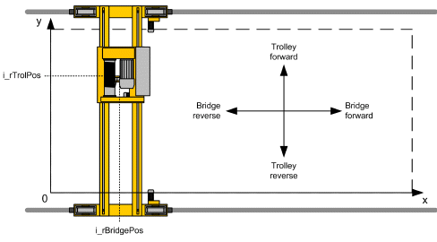

# Coordinate System

Coordinate System

Movement of the crane bridge corresponds to the X axis and movement of the trolley to the Y axis in Cartesian coordinates.

The position value of both axes must increase in forward direction and decrease in reverse direction.

The function block supports both positive and negative values of crane bridge and trolley positions.

The center of the coordinate system can be within the operating area and the crane can move in the four quadrants. Restricted areas can be also defined anywhere on the plane defined by axes X and Y.

Position of the hoist is the distance of the hook from the topmost position.

Coordinate system, top-down view

