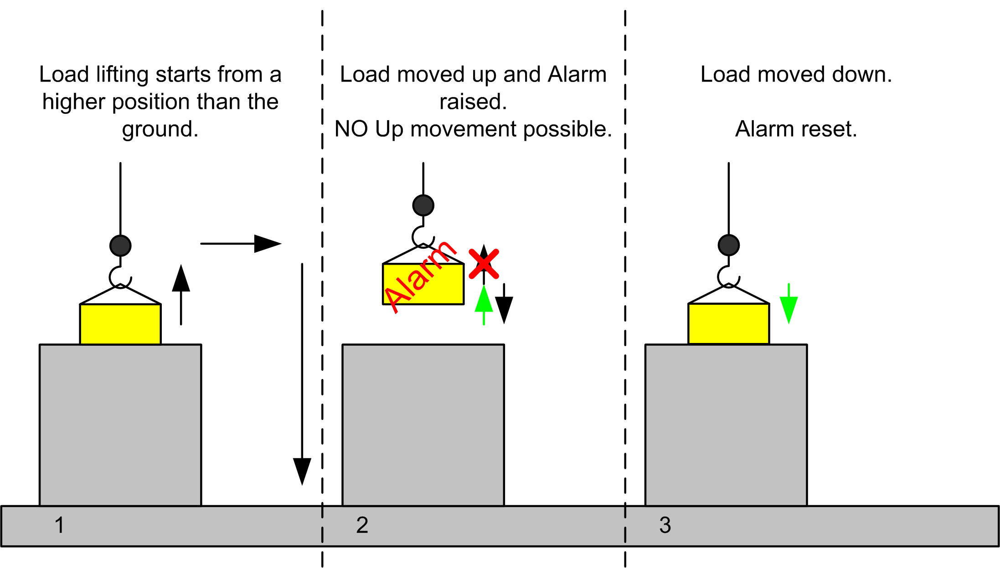
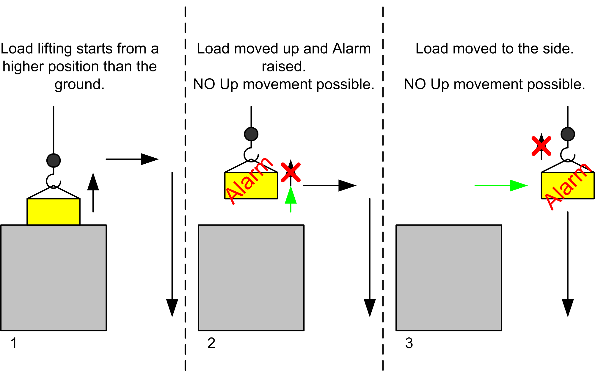
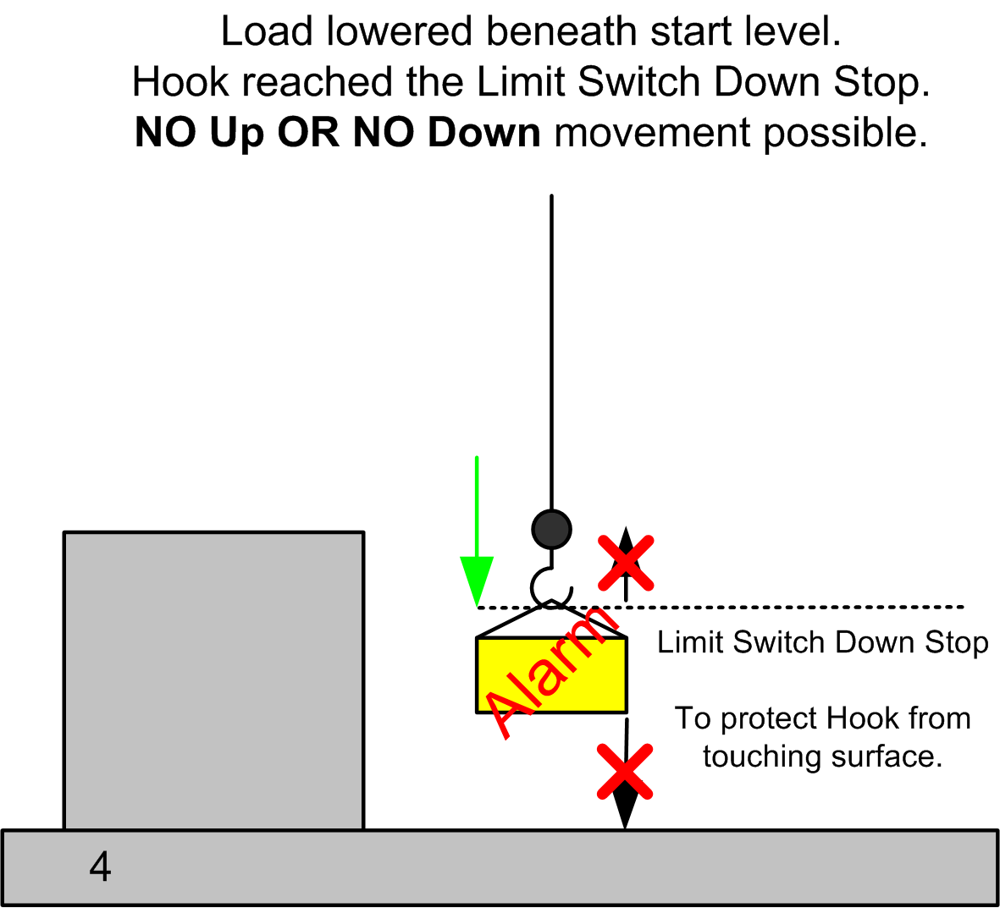

# Considerations for the Configuration

Considerations for the Configuration

A condition may arise where both upward and downward movement of the load may be prevented due to the hook limit switch down stop position during an overload alarm. To better explain this condition, consider the following scenarios.

Scenario A: Movement with reset by lowering the load on the starting position.

Legend:

| Symbol | Meaning |
| --- | --- |
| G-SE-0011747.1.gif-high.gif | Intended movement |
| G-SE-0011746.1.gif-high.gif | Disallowed movement (restricted by the [AFB](../glossary/glossary.htm#XREF_D_SE_0024697_621)) |
| G-SE-0011748.1.gif-high.gif | Movement done |

1. The operator wants to move a load from a higher position to the ground.

2. After lifting the load up, the Overload alarm is signaled. A continued up movement is no longer possible.

3. The load is set back on the starting position and the Overload alarm is reset.

Scenario B: Movement with moving the load to the side and attempting to the ground.

Legend:

| Symbol | Meaning |
| --- | --- |
| G-SE-0011747.1.gif-high.gif | Intended movement |
| G-SE-0011746.1.gif-high.gif | Disallowed movement (restricted by the AFB) |
| G-SE-0011748.1.gif-high.gif | Movement done |

1. The operator wants to move a load from a higher position to the ground.

2. After lifting the load up, the Overload alarm is signaled. A continued up movement is no longer possible.

3. The load is moved to the side to lower it down to the ground.

4. The load is lowered beneath the starting level. The AFB still maintains the alarm and does not allow an up movement.

If the Hook reaches the Limit switch for the down movement, before lowering the load onto the ground, the operator can not move the load either up or down. The AFB limits upward movement of the load due to the Overload alarm, and the Limit switch does not allow further downward movement. The load, which is overloading the crane, is suspended and the operator can not move it.

To prevent this condition, you must make sure that the load length is greater than the distance imposed by the Limit Switch Down Stop:

5. A high limit switch position for the Hook down stop movement could block either upward or downward movement of the load.

6. To prevent this condition, the load length must be greater than the limit switch for down stop movement level.

|  |
| --- |
| Warning_Color.gifWARNING |
| PROLONGED SUSPENSION OF AN OVERLOAD |
| Ensure that the configuration of the mechanical limit switch down stop does not prevent any load from being positioned on the ground. |
| Failure to follow these instructions can result in death, serious injury, or equipment damage. |