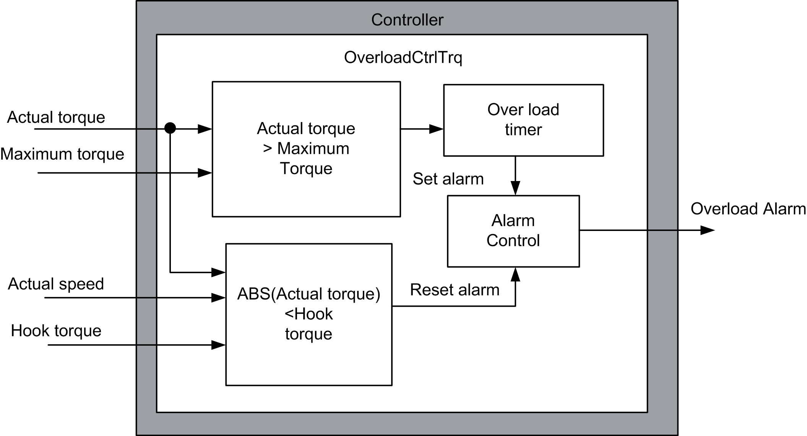

# DataFlow Overview - Overload Control Torque Method

DataFlow Overview - Overload Control Torque Method

In this overload control torque method, when the actual torque is greater than or equal to the maximum torque for a period of time defined by the user an overload alarm is generated. The overload alarm will only reset when the actual torque is less than the hook torque and the hoist is moving down.