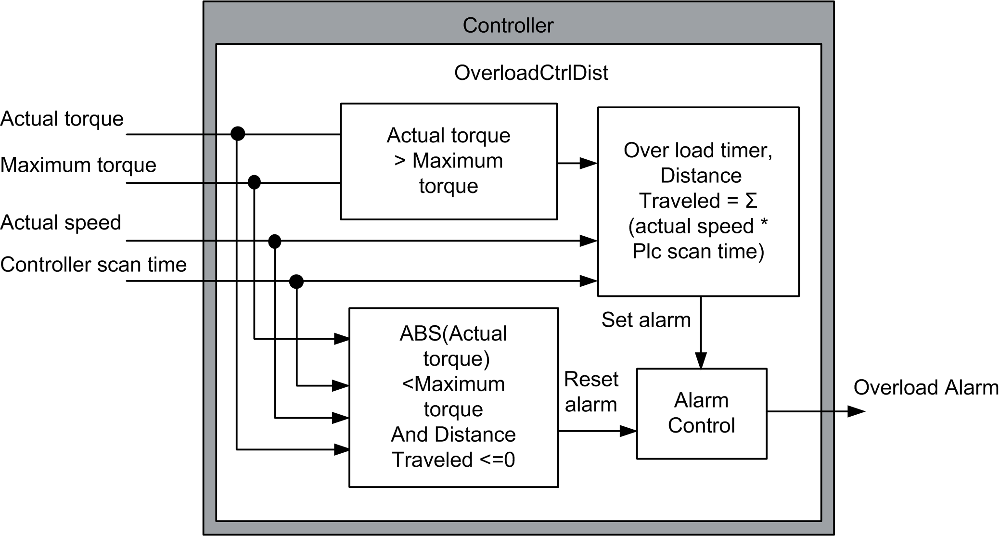

# DataFlow Overview - Overload Control Distance Method

DataFlow Overview - Overload Control Distance Method

In this overload control distance method, when the actual torque is greater than the maximum torque for a period of time defined, an overload alarm is generated.

Distance traveled = Distance traveled + Actual speed (RPM) \* (Controller scan time (ms) /60000)

The overload alarm will only reset when the actual torque is less than the maximum torque and the distance traveled under overload is less than or equal to zero.