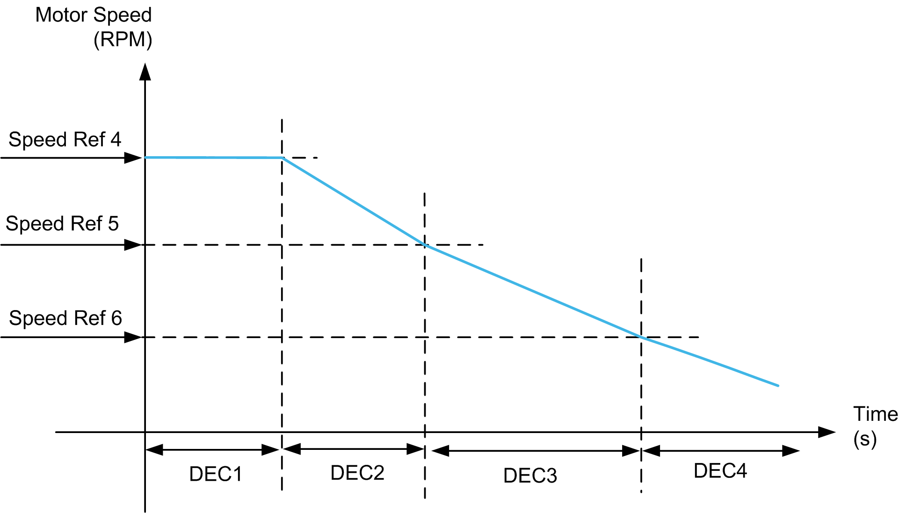

# Deceleration Parameter

Deceleration Parameter

During deceleration, the deceleration parameter is selected from four pre-defined deceleration values (DEC1, DEC2, DEC3 and DEC4), as the actual speed reaches threshold (speed4, speed5 and speed6 respectively).

| Comparing Actual Speed with Defined Speed | Deceleration Value |
| --- | --- |
| i\_iDrvSpdActl >= i\_wDrvSpdRef4 | i\_wDrvDecLvl1 |
| i\_iDrvSpdActl >= i\_wDrvSpdRef5 | i\_wDrvDecLvl2 |
| i\_iDrvSpdActl >= i\_wDrvSpdRef6 | i\_wDrvDecLvl3 |
| None of the above condition holds good then | i\_wDrvDecLvl4 |

Example:

If Spd4 = 1500 RPM, Spd5 = 1000 RPM, and Spd6 = 500 RPM (that is, Spd4 > Spd5 > Spd6) then:

| If actual speed is between... | Then deceleration is... |
| --- | --- |
| 1500 and HSP RPM, | DEC1 |
| 1000 and 1500 RPM, | DEC2 |
| 500 and 1000 RPM, | DEC3 |
| 0 and 500 RPM, | DEC4 |

NOTE: You must set Speed levels such that Spd4>Spd5>Spd6 to get a three slope deceleration curve. If less than four levels of deceleration are required, the values for DEC2, DEC3 and DEC4 should be set the same.