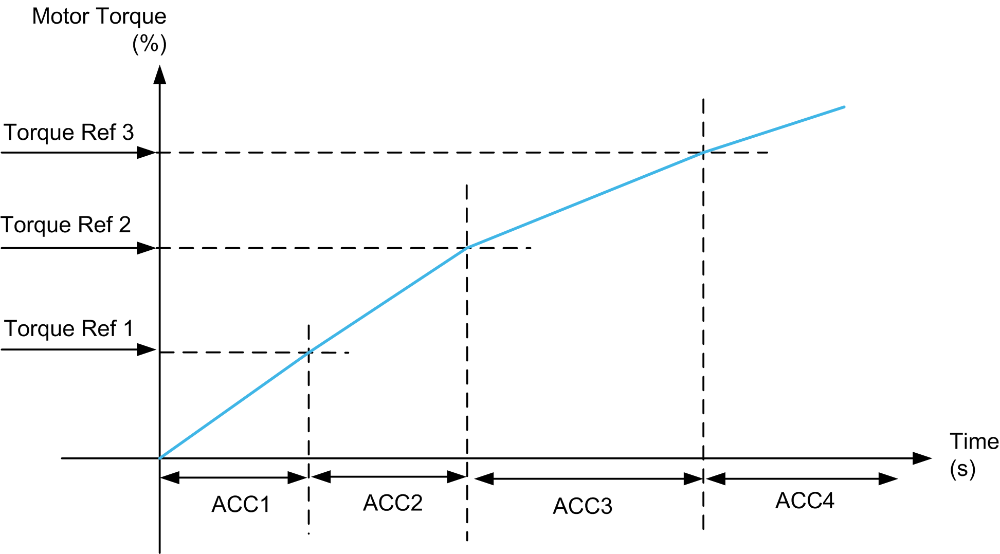

# Acceleration Parameter

Acceleration Parameter

During acceleration, the acceleration parameter is selected from 4 pre-defined acceleration values (ACC1, ACC2, ACC3 and ACC4) as the actual torque reaches the threshold (Trq1, Trq2 and Trq3 respectively).

| Comparing Actual Torque with Defined Torque | Acceleration Value |
| --- | --- |
| i\_iDrvTrqActl >= i\_wDrvTrqRef3 | i\_wDrvAccLvl4 |
| i\_iDrvTrqActl >= i\_wDrvTrqRef2 | i\_wDrvAccLvl3 |
| i\_iDrvTrqActl >= i\_wDrvTrqRef1 | i\_wDrvAccLvl2 |
| None of the above condition holds good then | i\_wDrvAccLvl1 |

Example:

If Trq1 = 10%, Trq2 = 20%, Trq3 = 30% (that is, Trq1<Trq2<Trq3) then,

| If actual torque is between... | Then acceleration is... |
| --- | --- |
| 0 and 10%, | ACC1 |
| 10 and 20%, | ACC2 |
| 20 and 30%, | ACC3 |
| 30 and MAX (300)%, | ACC4 |

NOTE: You must set torque levels such that Trq1<Trq2 <Trq3 to give a four slope acceleration curve. If less than 4 levels of acceleration are required, the values for ACC2, ACC3 and ACC4 should be set to the same value.