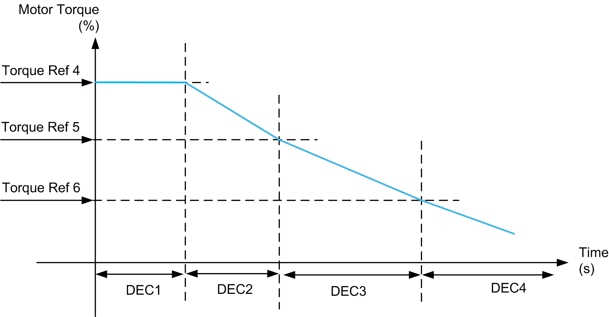

# Deceleration Parameter

Deceleration Parameter

During deceleration, the deceleration parameter is selected from 4 pre-defined deceleration values (DEC1, DEC2, DEC3 and DEC4), as the actual torque reaches threshold Trq4, Trq5 and Trq6 respectively.

| Comparing Actual Torque with Defined Torque | Deceleration Value |
| --- | --- |
| i\_iDrvTrqActl >= i\_wDrvTrqRef4 | i\_wDrvDecLvl1 |
| i\_iDrvTrqActl >= i\_wDrvTrqRef5 | i\_wDrvDecLvl2 |
| i\_iDrvTrqActl >= i\_wDrvTrqRef6 | i\_wDrvDecLvl3 |
| None of the above condition holds good then | i\_wDrvDecLvl4 |

Example:

If Trq4 = 30%, Trq5 = 20%, and Trq6 = 10% (that is, Trq4>Trq5>Trq6) then,

| If actual speed is between... | Then deceleration is... |
| --- | --- |
| 30 and Max (300)%, | DEC1 |
| 20 and 30%, | DEC2 |
| 10 and 20%, | DEC3 |
| 0 and 10%, | DEC4 |

NOTE: You must to set torque levels such that Trq4>Trq5>Trq6 to get a three slope deceleration curve. If less than four levels of deceleration are required, the values for DEC2, DEC3 and DEC4 should be set the same.