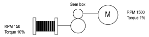

# Solution with the SpeedOptRopeSlack Function Block

Solution with the SpeedOptRopeSlack Function Block

The Speed optimization solution maintains operation at constant power consumption in order to reach a speed greater than the rated speed without exceeding the rated motor current. Constant power operation increases the system efficiency and helps to protect the motor by keeping the over-speed value in check based on the actual torque measured.

The Rope slack function is used to avoid extra rope being let out once the hook has touched the floor.

NOTE: The load on the motor at hook level must be at minimum 10% of the nominal load. Otherwise, the function can not work correctly due, at least in part, to the inefficiency of the gear box. If the load torque is below the minimum 10%, the further reduction by the gear box creates a scenario in which the Altivar drive is not able to determine between generator and motor mode. The result is a non optimized movement with limited speed.

