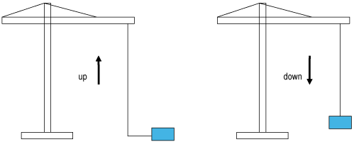

# Software Architecture Overview

Software Architecture Overview

The Speed optimization function monitors the actual torque of the motor via drive. When the actual torque goes above the 70% of hook torque, the function block compares the speed reference with the nominal speed. When the speed reference is greater than or equal to the nominal speed of the drive, then the function block calculates the optimized speed.

The optimized speed is calculated using dynamic torque when the hoist is moving up.

When the hoist is moving down, you have the following facility:

oCalculate the optimized speed only once while coming down.

oCalculate the optimized speed continuously.

The Rope slack function is used to avoid slack in the rope when the hoist is moved in a downward direction. If the actual torque drops below the user-defined hook-torque (for down movement) during any downward movement, any further movement is restricted to the minimum speed until the actual torque reaches the hook-torque. The speed reference is sent to the ATV drive which is connected to the motor and to the mechanical assembly.

The following figure represents the Rope slack function for up and down movement.

