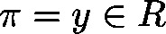
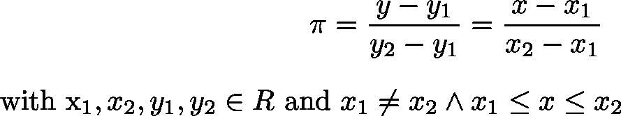

# LinearTrafo (FB)

FUNCTION\_BLOCK LinearTrafo

This function will calculate the linear transformation  of  according to

| InOut: | | Scope | Name | Type | Comment | | --- | --- | --- | --- | | Input | lrInputValue | LREAL | Value  to be transformated | | lrInput1 | LREAL | Coefficient | | lrInput2 | LREAL | Coefficient | | lrOutput1 | LREAL | Coefficient | | lrOutput2 | LREAL | Coefficient | | Output | lrOutputValue | LREAL | Linear transformation  of | | xOutOfLimits | BOOL | Error flag  TRUE: If | |

3.5.19.0

© Copyright 2025, CODESYS GmbH